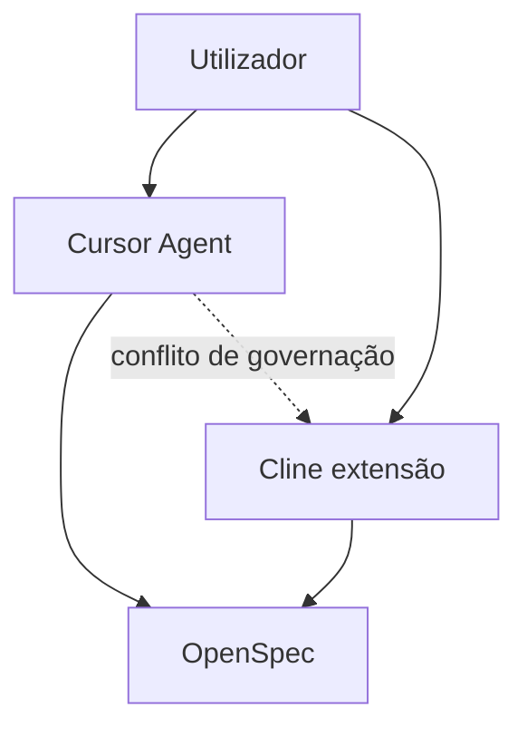
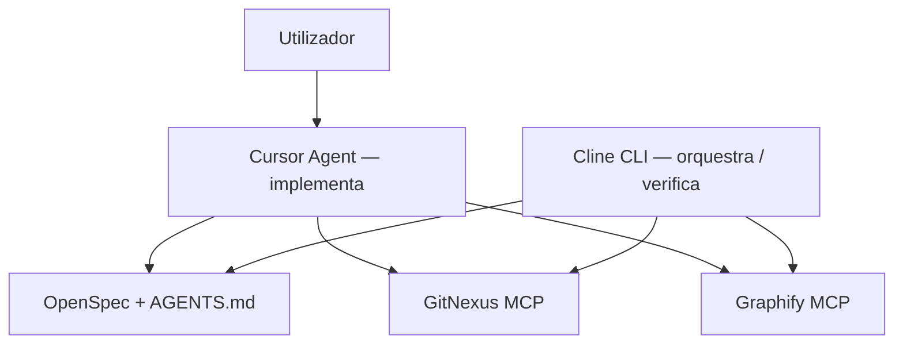

# Cline × Sistema SDD — Avaliação e Integração Futura

**Status:** desenvolvimento futuro (não implementado)  
**Versão do documento:** 0.1.0  
**Data:** 2026-06-16  
**Relacionado:** [sistema-sdd-pedro.md](./sistema-sdd-pedro.md) v1.2.0 · [AGENTS.md](../AGENTS.md) · [openspec/project.md](../openspec/project.md)

> Avaliação arquitectural sobre incluir [Cline](https://cline.bot/) no ecossistema SDD (OpenSpec + GitNexus + Graphify) quando instalado num repositório de desenvolvimento. Define **papéis recomendados**, **vantagens/desvantagens** e **roadmap de implementação** para sessão futura de aprofundamento.

---

## Índice

1. [Contexto e pergunta](#1-contexto-e-pergunta)
2. [O que o SDD já resolve](#2-o-que-o-sdd-já-resolve)
3. [O que o Cline acrescenta](#3-o-que-o-cline-acrescenta)
4. [Vantagens](#4-vantagens)
5. [Desvantagens e riscos](#5-desvantagens-e-riscos)
6. [Arquitecturas avaliadas](#6-arquitecturas-avaliadas)
7. [Veredicto e recomendação](#7-veredicto-e-recomendação)
8. [Papéis definidos para integração](#8-papéis-definidos-para-integração)
9. [Desenvolvimento futuro — roadmap de implementação](#9-desenvolvimento-futuro--roadmap-de-implementação)
10. [Critérios de adopção](#10-critérios-de-adopção)
11. [Referências](#11-referências)

---

## 1. Contexto e pergunta

### Cenário proposto

Ao instalar o sistema SDD (`doc/sistema-sdd-pedro.md`) numa pasta onde se desenvolve software, o Cline actuaria como **administrador** do projecto — entendendo melhor **o quê**, **quando** e **como** executar tarefas, em coordenação com Cursor.

### Pergunta central

> Vale a pena integrar o Cline como administrador dentro do Cursor, ou o SDD já cobre esse papel via `AGENTS.md` + OpenSpec + harness MCP?

### Premissa de avaliação

O `openspec/project.md` mede sucesso do SDD pela capacidade de **qualquer agente de IA** navegar, entender e propor mudanças fundamentadas **sem intervenção humana desnecessária**. A questão não é se o Cline *consegue* operar o SDD (consegue, via MCP e regras), mas se **duplicar orquestração** no mesmo IDE traz retorno líquido positivo.

---

## 2. O que o SDD já resolve

Quando o SDD está instalado num repo alvo, a camada de “administração” já está definida:

| Camada | Papel administrativo |
|--------|----------------------|
| `AGENTS.md` | Constituição operacional: classificação A–E, pipelines, prioridades de fontes |
| OpenSpec | Intenção e decisões (`/opsx:propose` → apply → archive) |
| GitNexus | Impacto, estrutura de código, blast radius |
| Graphify | Conhecimento acumulado (docs, specs arquivadas, teoria) |
| `.cursor/rules/*.mdc` + MCP | Harness no Cursor (regras, slash commands, ferramentas) |

O pipeline visual completo está em `doc/sistema-sdd-pedro.md` §3.4 — desde classificação do prompt até feedback `graphify update` após archive.

**Conclusão parcial:** o “administrador” conceptual já existe; é **documentado e agente-agnóstico**, não atado a um runtime específico.

---

## 3. O que o Cline acrescenta

[Cline](https://cline.bot/) é um runtime de agente open source (Apache 2.0) com:

- Extensão IDE (VS Code / Cursor) + **CLI** (`npm i -g cline`)
- Modo **Plan → Act** com aprovação por passo e checkpoints com undo
- Execução de bash com reacção a output em tempo real
- Regras via `.clinerules` e suporte a Skills
- **Multi-agent teams** (coordinator + specialists)
- MCP e plugins; integrações Slack, Linear, CI
- Model-agnostic (Claude, GPT, Gemini, Ollama, endpoints OpenAI-compatíveis)

---

## 4. Vantagens

### 4.1 Plan-then-Act alinha-se ao OpenSpec

O fluxo Plan → aprovação → Act do Cline mapeia naturalmente para:

- Tarefas Tipo C/D/E → proposta OpenSpec antes de código
- Human gate entre proposta e implementação
- Checkpoints com undo por passo (útil em refactors multi-ficheiro)

### 4.2 Execução autónoma no terminal

Para um papel de **executor/verificador** que corre comandos:

- Testes, `gitnexus analyze --force`, `graphify update .`
- Checklists §2.8 e §2.9 do guia SDD
- Dev servers longos, validações locais, scripts de upgrade

### 4.3 Orquestrador headless (CLI)

O modelo coordinator + specialists do Cline pode espelhar o pipeline Tipo D do SDD:

- `graphify-researcher` ∥ `codebase-researcher` em paralelo (§3.3 do guia)
- Síntese no agente principal após subagents terminarem
- Cline CLI em **CI/cron** enquanto o Cursor permanece para edição interactiva

### 4.4 Agente de verificação (anti self-review)

Sessão Cline **separada** da que implementou código:

- Auditar diff vs `openspec/changes/<id>/specs/`
- Correr `openspec validate`, impact analysis, smoke tests
- Reduz o viés de “o mesmo agente que implementou validar a si próprio”

### 4.5 Model-agnostic e automação externa

- BYOK ou modelos locais fora da subscrição Cursor
- Integrações Slack/Linear/GitHub Actions que o Cursor não cobre nativamente
- Open source — auditável e embeddable via SDK

---

## 5. Desvantagens e riscos

### 5.1 Dois agentes no mesmo Cursor

O guia SDD alerta explicitamente (§aviso prévio): ferramentas que geram ou modificam `AGENTS.md` criam conflitos de governação. Cline acrescenta **mais um ecossistema de regras**:

| Fonte de regras | Consumidor típico |
|-----------------|-------------------|
| `AGENTS.md` | Universal (canónico) |
| `.cursor/rules/*.mdc` | Cursor Agent |
| `.clinerules` | Cline |

**Risco:** drift — Cursor Agent segue um conjunto, Cline outro. Manutenção tripla se não houver regra: *Cline só lê `AGENTS.md`; nunca inventa regras paralelas*.

### 5.2 Sobreposição com Cursor Agent

O Cursor já oferece Agent mode, MCP (GitNexus, Graphify), rules, subagents (Explore, Task), slash commands `/opsx:*` e skills. Cline **dentro** do Cursor não adiciona capacidade estrutural nova — adiciona **segunda interface** para trabalho semelhante, com custo em tokens e confusão operacional.

### 5.3 Slash commands OpenSpec

`/opsx:propose`, `/opsx:apply`, `/opsx:archive` são comandos **Cursor** gerados por `openspec update`. O Cline não os consome nativamente; exige replicar a lógica em prompts/skills ou invocar manualmente os artefactos em `openspec/changes/`.

### 5.4 “Administrador” ≠ melhor contexto

O SDD já define *quando* e *como* via classificação A–E. O que falta na prática são **sensores** (evals, CI, code review) — não necessariamente outro runtime. O workshop (`doc/curso/aula-02-workshop-ia-5-2026.md`) nota que ainda não há ferramental que **garanta** que a spec é fonte da verdade permanente.

### 5.5 Fricção no IDE

Cline é extensão VS Code; no Cursor funciona mas não é runtime nativo. Possíveis conflitos de painéis, atalhos, aprovações de terminal e **dois históricos** de conversa sobre o mesmo change OpenSpec.

### 5.6 Custo operacional

- Duas vias de billing/API se ambos usam modelos pagos
- Sincronização de MCP (global vs project-level)
- Curva de aprendizagem: “uso Cursor ou Cline para quê?”

---

## 6. Arquitecturas avaliadas

### 6.1 Fraco — dois chefes no IDE



**Veredicto:** desaconselhado como modelo por defeito.

### 6.2 Forte — papéis separados



**Veredicto:** recomendado — complementaridade sem competição no painel.

### 6.3 Tabela comparativa

| Modelo | Veredicto |
|--------|-----------|
| Cline extensão + Cursor Agent, ambos “admin” no mesmo repo | ⚠️ Desaconselhado |
| Cursor implementa; Cline CLI verifica/orquestra em CI | ✅ Bom |
| Cline CLI como único entry point; Cursor só editor | ✅ Possível (autopilot headless) |
| Só Cursor + SDD (estado actual guia v1.2) | ✅ Suficiente para maioria dos casos |

---

## 7. Veredicto e recomendação

### Não fazer (por defeito)

**Não instalar o Cline como administrador integrado ao Cursor no dia-a-dia de desenvolvimento.** O SDD já define o administrador em `AGENTS.md` + OpenSpec; o Cursor Agent com MCP cobre implementação e research.

### Considerar Cline quando

1. **Orquestrador headless** — CLI em CI/cron para validações SDD
2. **Agente de verificação** — sessão separada pós-`/opsx:apply`
3. **Automação multi-canal** — Slack, Linear, pipelines sem IDE
4. **Modelo local / BYOK** fora da subscrição Cursor

### Regra rígida (se experimentar no IDE)

```text
Cline NÃO é fonte de regras.
Cline LÊ AGENTS.md + openspec/changes/<id>/ antes de qualquer Act.
Cline NÃO implementa features por defeito — classifica (A–E), propõe ou verifica.
Implementação = Cursor Agent (ou runtime principal definido no repo).
```

Espelhar `.clinerules` como **ponte** para `AGENTS.md`, nunca como duplicata autónoma.

---

## 8. Papéis definidos para integração

Quando a integração for implementada, o Cline deve ocupar **apenas** estes papéis — nunca todos ao mesmo tempo no mesmo repo sem configuração explícita:

| ID | Papel | Runtime | Quando activar |
|----|-------|---------|----------------|
| **C1** | Verificador pós-apply | Cline CLI ou sessão IDE isolada | Após `/opsx:apply` ou antes de merge/PR |
| **C2** | Orquestrador CI | Cline CLI headless | Push/PR, cron, upgrade SDD §2.9 |
| **C3** | Coordinator research (Tipo D) | Cline multi-agent | Propostas que exigem Graphify ∥ GitNexus |
| **C4** | Gateway externo | Cline + Slack/Linear | Triage de pedidos fora do IDE |

### Papéis explicitamente excluídos

| Papel | Motivo |
|-------|--------|
| Fonte canónica de regras | Reservado a `AGENTS.md` |
| Substituto de `/opsx:*` no Cursor | Comandos OpenSpec são harness Cursor |
| Implementador primário + verificador na mesma sessão | Viés de self-review |
| “Admin” concorrente do Cursor Agent no IDE | Drift e custo duplicado |

### Mapeamento SDD ↔ Cline

| Fase SDD | Cursor Agent | Cline (papéis C1–C4) |
|----------|--------------|----------------------|
| Classificação A–E | Sim | C2 pode pré-classificar em CI |
| `/opsx:propose` | Sim | C3 pode preparar inputs de research |
| `/opsx:apply` | Sim | Não (implementação) |
| Verificação pós-implementação | Opcional (`simplify-review`) | **C1** (preferido) |
| `openspec validate` + checklist §2.8 | Manual | **C2** automatizado |
| Upgrade SDD §2.9 | Humano aprova relatório | **C2** corre diff/staging |

---

## 9. Desenvolvimento futuro — roadmap de implementação

> **Próxima sessão:** aprofundar implementação concreta. Itens abaixo são backlog documentado; nenhum está implementado neste repositório.

### Fase 0 — Decisão e piloto (pré-requisito)

- [ ] **0.1** Escolher 1 repo piloto (perfil APP ou HYBRID)
- [ ] **0.2** Definir runtime principal: Cursor Agent implementa; Cline só C1 ou C2
- [ ] **0.3** Documentar decisão em `openspec/changes/<id>/proposal.md` quando iniciar implementação

### Fase 1 — Harness mínimo Cline (verificador C1)

- [ ] **1.1** Criar `.clinerules` que **apenas** redirecciona para `AGENTS.md` (espelho de `.cursor/rules/000-base.mdc`)
- [ ] **1.2** Skill ou prompt `cline-verify-sdd` com checklist:
  - Ler `openspec/changes/<id>/tasks.md` e marcar itens
  - `npx openspec validate <id>`
  - GitNexus impact nos símbolos alterados
  - Testes indicados na spec
- [ ] **1.3** Proibir Act de implementação na skill C1 (modo read-only + bash de verificação)
- [ ] **1.4** Validar em 1 change real antes de generalizar

### Fase 2 — Orquestrador CI (C2)

- [ ] **2.1** Script `scripts/sdd-cline-verify.sh` invocável por Cline CLI
- [ ] **2.2** Workflow GitHub Actions (ou equivalente) com:
  - `openspec validate` em changes activos
  - `gitnexus analyze --force` se código mudou
  - Relatório Markdown como artefacto de CI
- [ ] **2.3** Integrar checklist §2.8 / §2.9.7 como gates opcionais
- [ ] **2.4** Documentar variáveis de ambiente (sem secrets no repo)

### Fase 3 — Research coordinator (C3)

- [ ] **3.1** Definir specialists Cline alinhados a §3.3 do guia:
  - `graphify-researcher` → `knowledge.md`
  - `codebase-researcher` → `codebase.md`
- [ ] **3.2** Prompt de síntese no agente principal antes de `/opsx:propose`
- [ ] **3.3** Testar paralelismo vs Cursor Explore agent (comparar tokens/latência)

### Fase 4 — Integração no guia SDD

- [ ] **4.1** Secção opcional em `doc/sistema-sdd-pedro.md` (§15 ou apêndice) — **só após Fase 1 validada**
- [ ] **4.2** Entrada em `AGENTS.md` → Contexto sob demanda (já referenciado)
- [ ] **4.3** Template `.clinerules` em anexo do guia (se adoptado)
- [ ] **4.4** Spec OpenSpec `openspec/specs/cline-integration/spec.md` ao arquivar change

### Fase 5 — Gateway externo (C4, opcional)

- [ ] **5.1** Avaliar Cline + Slack/Linear para triage de issues
- [ ] **5.2** Mapear pedidos externos → classificação A–E → change OpenSpec
- [ ] **5.3** Política de aprovação humana antes de Act

### Entregáveis previstos (implementação futura)

| Artefacto | Fase | Descrição |
|-----------|------|-----------|
| `doc/cline-integracao-sdd.md` | — | Este documento (avaliação + roadmap) |
| `.clinerules` | 1 | Ponte para `AGENTS.md` |
| `.cline/skills/cline-verify-sdd/` | 1 | Verificador pós-apply |
| `scripts/sdd-cline-verify.sh` | 2 | Entry point CI |
| `.github/workflows/sdd-cline-verify.yml` | 2 | Gate automatizado |
| `openspec/specs/cline-integration/spec.md` | 4 | Requisitos formais |

---

## 10. Critérios de adopção

Adoptar integração Cline no repo alvo **somente se** pelo menos uma condição for verdadeira:

| # | Condição |
|---|----------|
| A | Necessidade de verificação automatizada pós-apply em CI |
| B | Pipeline headless sem IDE (cron, Actions, Slack) |
| C | Requisito de modelo local/BYOK para tarefas de verificação |
| D | Equipa com disciplina para manter `.clinerules` sincronizado com `AGENTS.md` |

**Não adoptar** se o objectivo for apenas “agente mais inteligente no Cursor” — reforçar `AGENTS.md`, rules e MCP resolve com menos fricção.

### Alternativa mais simples (sem Cline)

Reforçar sensores no SDD actual:

- Hooks pós-commit (`graphify hook install` já previsto)
- Skill `simplify-review` pós-apply
- CI com `openspec validate` + testes (sem runtime Cline)
- Code review humano ou Cloud Agent dedicado a review

---

## 11. Referências

| Recurso | Ligação / path |
|---------|----------------|
| Cline | https://cline.bot/ |
| Guia SDD v1.2 | `doc/sistema-sdd-pedro.md` |
| AGENTS.md canónico | `AGENTS.md` |
| Constituição do projecto | `openspec/project.md` |
| Pipeline A–E | `doc/sistema-sdd-pedro.md` §3 |
| Aviso governação AGENTS.md | `doc/sistema-sdd-pedro.md` §aviso prévio |
| Spec como fonte da verdade (debate) | `doc/curso/aula-02-workshop-ia-5-2026.md` |
| Padrão agents.md | https://agents.md/ |

---

## Changelog

### 0.1.0 (2026-06-16)

- Avaliação inicial: vantagens, desvantagens, arquitecturas, veredicto.
- Papéis C1–C4 definidos para integração futura.
- Roadmap Fases 0–5 marcado como desenvolvimento futuro.

---

*Documento de avaliação — não altera o guia SDD v1.2 nem comportamento de agentes até conclusão das fases de implementação.*
