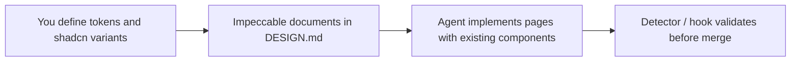

# Impeccable + design system — reference guide

> **shadcn/ui = default path (Phase 2).** Alternatives without shadcn: [`003-ui-stack-adapters.md`](./003-ui-stack-adapters.md). Module install: [`002-ui-module-install.md`](./002-ui-module-install.md).
>
> **Import and adaptation status**
>
> - **Origin:** [pvilarim/topocnc-art](https://github.com/pvilarim/topocnc-art) repository, branch `import/site-metal-p5`, imported on 2026-06-27 into **spec-pedro** (`gitnexus-graphify-openspec`).
> - **Status:** `[REFERENCE — NEEDS ADAPTATION]` — technical text preserved; path examples and 3D/CNC scope reflect the source project (TerraCNC / topocnc.art).
> - **Next step:** integrate the pipeline (Open Design → Pencil/Figma → shadcn → Impeccable) into the canonical guide [`doc/sistema-sdd-pedro.md`](../sistema-sdd-pedro.md) and the install kit `sdd-kit/`, for distribution to any repository using the SDD stack (OpenSpec + GitNexus + Graphify).
> - Sections marked with **[if applicable]** apply only to projects with a Next.js app, 3D configurator, or CNC — not to this hub's **DOCS_SPECS** profile.

Analysis document and future adoption plan. Consolidated in Jun/2026 from an evaluation of [Impeccable](https://github.com/pbakaus/impeccable) for an APP monorepo with shadcn/ui.

**Goal:** use Impeccable as a guidance layer for AI agents, **keeping shadcn/ui and existing tokens** as the design system base — without replacing product-specific domains (e.g. parametric configurator, CNC skills) already versioned in the target repo.

**Full pipeline (POC → production):** [`001-pipeline-open-design-shadcn-impeccable.md`](./001-pipeline-open-design-shadcn-impeccable.md) — Open Design (exploration), **Pencil or Figma MCP** (prototyping), shadcn (implementation), Impeccable (production).

---

## 1. What Impeccable is (and what it is not)

| Is | Is not |
|----|--------|
| Skill + CLI **design guide for AI agents** | React component kit (like Material UI) |
| 23 commands (`polish`, `audit`, `typeset`, `layout`, …) | Ready-made theme that replaces `globals.css` |
| Detector with **44 deterministic rules** (anti “AI slop”) | Figma or visual design tool |
| Context files (`PRODUCT.md`, `DESIGN.md`) | shadcn/ui replacement |
| Cursor hook that reviews UI edits | Parametric / CNC skill **[if applicable]** |

**License:** [Apache 2.0](https://github.com/pbakaus/impeccable/blob/main/LICENSE) — **free**, commercial use allowed, open source.

**Official links:**

- Repository: https://github.com/pbakaus/impeccable
- Documentation: https://impeccable.style
- npm CLI: https://www.npmjs.com/package/impeccable

---

## 2. How it fits with shadcn/ui and the design system

### Principle

**You define the design system; Impeccable helps the agent respect it.**

In an **APP** project (Next.js + shadcn), the typical base is:

| Layer | Typical path |
|-------|--------------|
| CSS tokens (HSL) | `app/globals.css` — or `apps/web/app/globals.css` in a monorepo |
| Tailwind theme | `tailwind.config.ts` — or `apps/web/tailwind.config.ts` |
| UI components | `components/ui/*` (shadcn/Radix) |
| Class utility | `lib/utils.ts` (`cn()`) |

> **Note:** this repository (**spec-pedro**) is a **DOCS_SPECS** profile — it does not contain a Next.js app. The paths above apply to the **target project** where the SDD stack is installed.

Impeccable **scans** existing tokens and components and guides the agent to:

1. Use `Button`, `Card`, `Dialog`, etc. — not reinvent raw HTML
2. Apply semantic variables (`bg-primary`, `text-muted-foreground`) — not inline hex
3. Follow rules documented in `DESIGN.md` (to be created on adoption)
4. Avoid generic AI visual anti-patterns (generic gradients, Inter default, nested cards, …)

### Recommended workflow



### Current token state (reference)

In `globals.css` the active theme may be **violet** (shadcn), with Geist Sans as the default font. When evolving visual identity, change tokens first; then update `DESIGN.md` so Impeccable propagates the context.

---

## 3. Advantages of using it in the project

### Reduction of “generic AI look”

Explicit anti-patterns + detector (`npx impeccable detect`) cut common tells: Inter everywhere, purple-blue gradient, square icon above titles, cards inside cards, bounce easing, gray text on colored backgrounds.

### Shared vocabulary with the agent

Precise commands instead of “make it prettier”:

| Command | Use |
|---------|-----|
| `/impeccable init` | One-time setup: `PRODUCT.md`, `DESIGN.md`, brand/product mode |
| `/impeccable typeset` | Typography and hierarchy |
| `/impeccable layout` | Spacing and visual rhythm |
| `/impeccable colorize` | Strategic color use |
| `/impeccable polish` | Final pass before shipping |
| `/impeccable audit` | A11y, responsive, technical quality |
| `/impeccable critique` | UX review (hierarchy, clarity) |
| `/impeccable clarify` | Interface copy |
| `/impeccable harden` | Edge cases, i18n, text overflow |

### Persistent context across sessions

`PRODUCT.md` captures audience, tone of voice, and anti-references. Each command reads that context — the agent does not “forget” the brand every chat.

### Brand vs product

- **Brand:** marketing, landing, gallery, institutional pages
- **Product:** dashboard, admin, tools (configurator) **[if applicable]**

Landing polish rules **must not** be applied the same way to the 3D canvas or parameter panels **[if applicable]**.

### CI and Cursor hook

- **CLI:** `npx impeccable detect src/ --json` — no LLM, exit code for PR gates
- **Cursor hook:** can block UI edits with anti-patterns before they enter the file

### Complements existing skills (does not replace)

| Domain | Skill / resource in the target repo |
|--------|-------------------------------------|
| Public site, visual polish | **Impeccable** (to install) |
| shadcn components | `shadcn` plugin + `components/ui/*` |
| 3D configurator / DXF **[if applicable]** | project parametric skills |
| Parameter UI **[if applicable]** | configurator skills |
| CNC fabrication **[if applicable]** | project CNC skills |

---

## 4. Monorepo scope — apply only to the website?

**Yes.** Installation is usually at the project root; **usage** can be selective.

### Candidate surfaces ( **brand** mode)

| Route / area | Typical path |
|--------------|--------------|
| Home | `app/[locale]/page.tsx` |
| Gallery | `app/[locale]/gallery/` |
| Product | `app/[locale]/product/[id]/` |
| FAQ, About, Contact | `app/[locale]/faq/`, `about/`, `contact/` |
| Cart / checkout (UI chrome) | `app/[locale]/cart/` |
| Login / auth (public pages) | `app/[locale]/login/`, etc. |

> In a monorepo, prefix with `apps/web/` in the paths above.

### Surfaces to treat separately ( **product** mode or exclude from detector) **[if applicable]**

| Route / area | Reason |
|--------------|--------|
| Configurator `/app` | 3D tool UX; parametric skills |
| Admin | Internal panels, data density |
| User dashboard | App UI, not marketing |
| Exclusive demos | Prototypes with legacy Leaflet/Three |
| WebGL canvas | Outside “landing polish” scope |

### Example detector exclusion

After install, configure `.impeccable/config.json`:

```json
{
  "detector": {
    "ignoreFiles": [
      "components/parametric-panel/**",
      "lib/parametric/**",
      "app/**/app/**",
      "app/**/admin/**",
      "app/**/dashboard/**",
      "components/three/**"
    ]
  }
}
```

> Adjust prefix `apps/web/` if the frontend lives in a monorepo package.

Commands also accept area focus:

```
/impeccable polish landing
/impeccable audit gallery
/impeccable typeset the product page
```

---

## 5. Adoption checklist (when you decide to implement)

### Prerequisites

- [ ] Node **24+** in the dev environment (CLI installer requirement)
- [ ] Cursor with Agent Skills enabled (Settings → Rules)
- [ ] Documented visual identity decision (palette, typography, tone, anti-references)

### Installation

```bash
# At the target APP project root
npx impeccable install
```

Options: `--providers=cursor` and `--scope=project` for script/CI.

Then, in the Cursor chat:

```
/impeccable init
```

Choose **brand** for the public site; consider a second **product** context for admin/dashboard if you want polish there too.

### Define the design system (manual — before or alongside init)

1. **Tokens:** adjust `app/globals.css` and `tailwind.config.ts`
2. **Components:** customize variants in `components/ui/` (CVA + Tailwind)
3. **Document:** let Impeccable generate or refine `DESIGN.md` via `/impeccable document`
4. **Product:** fill `PRODUCT.md` with audience and tone for the target project

### Integration with repo agent workflow

- Keep routing in `AGENTS.md` (and versioned skills, if any)
- For **public site** tasks: mention Impeccable or use `/impeccable *` commands
- For **configurator** tasks **[if applicable]:** continue with domain parametric skills
- No conflict: Impeccable for shadcn chrome around the canvas; parametric skills for geometry/export

### CI (optional)

```bash
npx impeccable detect app/\[locale\]/gallery --json
```

Add a workflow step only for marketing folders, if desired.

### Update

```bash
npx impeccable update
```

---

## 6. Limitations and expectations

| Limitation | Implication |
|------------|-------------|
| Does not create a design system on its own | You still define colors, fonts, components |
| Does not replace brand decisions | `init` + `DESIGN.md` formalize what you decide |
| Live Mode (browser iteration) | Beta; useful for hero/gallery, not for WebGL **[if applicable]** |
| Current violet theme | Impeccable may flag “typical AI palette” — evaluate whether to keep or evolve identity |
| Install adds `.cursor/skills/impeccable` | Separate from versioned skills in `doc/` or `.claude/skills/`; do not mix into SDD skill checks |

---

## 7. Anti-patterns Impeccable fights (summary)

Useful when drafting `DESIGN.md` and project anti-references:

- Overused fonts (Arial, Inter, system default without intent)
- Gray text (`muted-foreground`) on colored backgrounds without contrast
- Pure black/gray without brand tint
- Everything inside `Card`; nested cards
- Generic purple-blue gradients
- Bounce/elastic easing in animations
- Small touch targets; tight padding
- Skipped heading hierarchy (h1 → h3)

**In the project:** prefer tokens in `globals.css`, `cn()`, `@/components/ui/*` components, i18n in `messages/` — aligned with `AGENTS.md` and target repo UI rules.

---

## 8. Ready-made prompts for agents (future)

Copy into chat when working on the site:

```
Use the guide doc/design/000-impeccable-design-system-guia.md.
Scope: public pages only (home, gallery, product).
Respect shadcn in components/ui and tokens in globals.css.
Do not change configurator /app or lib/parametric [if applicable].
```

```
/impeccable polish gallery
```

```
/impeccable audit app/[locale]/page.tsx
```

---

## 9. Related in this repository

| Document | Topic |
|----------|-------|
| [AGENTS.md](../../AGENTS.md) | Global agent routing |
| [openspec/project.md](../../openspec/project.md) | Project constitution (stack, profiles) |
| [doc/sistema-sdd-pedro.md](../sistema-sdd-pedro.md) | Canonical SDD install guide — **future destination for this pipeline** |
| [001-pipeline-open-design-shadcn-impeccable.md](./001-pipeline-open-design-shadcn-impeccable.md) | **Pipeline** OD → shadcn → Impeccable |

---

## 10. History

| Date | Note |
|------|------|
| 2026-06-26 | Document created in source repo (topocnc-art) — initial analysis |
| 2026-06-27 | Imported to spec-pedro; adapted for DOCS_SPECS hub; SDD guide integration pending |

**Status:** `[REFERENCE — NEEDS ADAPTATION]` — Impeccable is **not** installed in this repository (DOCS_SPECS profile).
