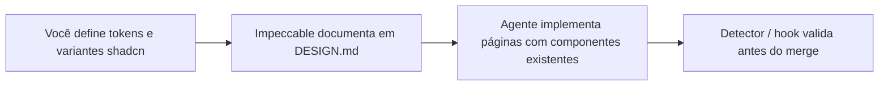

# Impeccable + design system — guia de referência

> **Importação e estado de adaptação**
>
> - **Origem:** repositório [pvilarim/topocnc-art](https://github.com/pvilarim/topocnc-art), branch `import/site-metal-p5`, importado em 2026-06-27 para **spec-pedro** (`gitnexus-graphify-openspec`).
> - **Status:** `[REFERÊNCIA — REQUER ADAPTAÇÃO]` — texto técnico preservado; exemplos de caminhos e escopo 3D/CNC reflectem o projeto de origem (TerraCNC / topocnc.art).
> - **Próximo passo:** integrar o pipeline (Open Design → Pencil/Figma → shadcn → Impeccable) no guia canónico [`doc/sistema-sdd-pedro.md`](../sistema-sdd-pedro.md) e no install kit `sdd-kit/`, para distribuição a qualquer repositório que use o stack SDD (OpenSpec + GitNexus + Graphify).
> - Secções marcadas com **[se aplicável]** só se aplicam a projectos com app Next.js, configurador 3D ou CNC — não ao perfil **DOCS_SPECS** deste hub.

Documento de análise e plano de adoção futura. Consolidado em jun/2026 a partir de avaliação do [Impeccable](https://github.com/pbakaus/impeccable) para um monorepo APP com shadcn/ui.

**Objetivo:** usar o Impeccable como camada de orientação para agentes de IA, **mantendo shadcn/ui e tokens existentes** como base do design system — sem substituir domínios específicos do produto (ex.: configurador paramétrico, skills CNC) já versionados no repo alvo.

**Pipeline completo (POC → produção):** [`001-pipeline-open-design-shadcn-impeccable.md`](./001-pipeline-open-design-shadcn-impeccable.md) — Open Design (exploração), **Pencil ou Figma MCP** (prototipagem), shadcn (implementação), Impeccable (produção).

---

## 1. O que é o Impeccable (e o que não é)

| É | Não é |
|---|-------|
| Skill + CLI de **guia de design para agentes de IA** | Kit de componentes React (tipo Material UI) |
| 23 comandos (`polish`, `audit`, `typeset`, `layout`, …) | Tema pronto que substitui `globals.css` |
| Detector com **44 regras determinísticas** (anti “AI slop”) | Figma ou ferramenta de design visual |
| Arquivos de contexto (`PRODUCT.md`, `DESIGN.md`) | Substituição do shadcn/ui |
| Hook no Cursor que revisa edições de UI | Skill paramétrica / CNC **[se aplicável]** |

**Licença:** [Apache 2.0](https://github.com/pbakaus/impeccable/blob/main/LICENSE) — **gratuito**, uso comercial permitido, open source.

**Links oficiais:**

- Repositório: https://github.com/pbakaus/impeccable
- Documentação: https://impeccable.style
- npm CLI: https://www.npmjs.com/package/impeccable

---

## 2. Como encaixa com shadcn/ui e o design system

### Princípio

**Você define o design system; o Impeccable ajuda o agente a respeitá-lo.**

Num projeto **APP** (Next.js + shadcn), a base típica é:

| Camada | Caminho típico |
|--------|----------------|
| Tokens CSS (HSL) | `app/globals.css` — ou `apps/web/app/globals.css` em monorepo |
| Tema Tailwind | `tailwind.config.ts` — ou `apps/web/tailwind.config.ts` |
| Componentes UI | `components/ui/*` (shadcn/Radix) |
| Utilitário de classes | `lib/utils.ts` (`cn()`) |

> **Nota:** este repositório (**spec-pedro**) é perfil **DOCS_SPECS** — não contém app Next.js. Os caminhos acima aplicam-se ao **projeto alvo** onde o stack SDD for instalado.

O Impeccable **escaneia** tokens e componentes existentes e orienta o agente a:

1. Usar `Button`, `Card`, `Dialog`, etc. — não reinventar HTML cru
2. Aplicar variáveis semânticas (`bg-primary`, `text-muted-foreground`) — não hex inline
3. Seguir regras documentadas em `DESIGN.md` (a criar na adoção)
4. Evitar anti-padrões visuais de IA (gradientes genéricos, Inter default, cards aninhados, …)

### Fluxo de trabalho recomendado



### Estado atual dos tokens (referência)

Em `globals.css` o tema activo pode ser **violet** (shadcn), com Geist Sans como fonte padrão. Ao evoluir a identidade visual, alterar primeiro os tokens; depois atualizar `DESIGN.md` para o Impeccable propagar o contexto.

---

## 3. Vantagens de usar no projeto

### Redução de “visual de IA genérico”

Anti-padrões explícitos + detector (`npx impeccable detect`) cortam tells comuns: Inter em tudo, gradiente roxo-azul, ícone quadrado acima de títulos, cards dentro de cards, easing bounce, texto cinza sobre fundo colorido.

### Vocabulário compartilhado com o agente

Comandos precisos em vez de “deixa mais bonito”:

| Comando | Uso |
|---------|-----|
| `/impeccable init` | Setup único: `PRODUCT.md`, `DESIGN.md`, modo brand/product |
| `/impeccable typeset` | Tipografia e hierarquia |
| `/impeccable layout` | Espaçamento e ritmo visual |
| `/impeccable colorize` | Uso estratégico de cor |
| `/impeccable polish` | Passagem final antes de shippar |
| `/impeccable audit` | A11y, responsivo, qualidade técnica |
| `/impeccable critique` | Revisão de UX (hierarquia, clareza) |
| `/impeccable clarify` | Copy de interface |
| `/impeccable harden` | Edge cases, i18n, overflow de texto |

### Contexto persistente entre sessões

`PRODUCT.md` captura público, tom de voz e anti-referências. Cada comando lê esse contexto — o agente não “esquece” a marca a cada chat.

### Brand vs product

- **Brand:** marketing, landing, galeria, páginas institucionais
- **Product:** dashboard, admin, ferramentas (configurador) **[se aplicável]**

Regras de polish de landing **não** devem ser aplicadas igual ao canvas 3D ou painéis de parâmetros **[se aplicável]**.

### CI e hook no Cursor

- **CLI:** `npx impeccable detect src/ --json` — sem LLM, exit code para gates de PR
- **Hook Cursor:** pode bloquear edições de UI com anti-padrões antes de entrarem no arquivo

### Complementa skills existentes (não substitui)

| Domínio | Skill / recurso no repo alvo |
|---------|------------------------------|
| Site público, polish visual | **Impeccable** (a instalar) |
| Componentes shadcn | Plugin `shadcn` + `components/ui/*` |
| Configurador 3D / DXF **[se aplicável]** | skills paramétricas do projeto |
| UI de parâmetros **[se aplicável]** | skills de configurador |
| Fabricação CNC **[se aplicável]** | skills CNC do projeto |

---

## 4. Escopo no monorepo — aplicar só no website?

**Sim.** A instalação costuma ser na raiz do projeto; o **uso** pode ser seletivo.

### Superfícies candidatas (modo **brand**)

| Rota / área | Caminho típico |
|-------------|----------------|
| Home | `app/[locale]/page.tsx` |
| Galeria | `app/[locale]/gallery/` |
| Produto | `app/[locale]/product/[id]/` |
| FAQ, About, Contact | `app/[locale]/faq/`, `about/`, `contact/` |
| Carrinho / checkout (chrome UI) | `app/[locale]/cart/` |
| Login / auth (páginas públicas) | `app/[locale]/login/`, etc. |

> Em monorepo, prefixar com `apps/web/` nos caminhos acima.

### Superfícies a tratar separado (modo **product** ou excluir do detector) **[se aplicável]**

| Rota / área | Motivo |
|-------------|--------|
| Configurador `/app` | UX de ferramenta 3D; skills paramétricas |
| Admin | Painéis internos, densidade de dados |
| Dashboard usuário | App UI, não marketing |
| Demos Exclusive | Protótipos com Leaflet/Three legado |
| Canvas WebGL | Fora do escopo de “polish de landing” |

### Exemplo de exclusão no detector

Após instalar, configurar `.impeccable/config.json`:

```json
{
  "detector": {
    "ignoreFiles": [
      "components/parametric-panel/**",
      "lib/parametric/**",
      "app/**/app/**",
      "app/**/admin/**",
      "app/**/dashboard/**",
      "components/three/**"
    ]
  }
}
```

> Ajustar prefixo `apps/web/` se o frontend estiver num pacote de monorepo.

Comandos também aceitam foco por área:

```
/impeccable polish landing
/impeccable audit gallery
/impeccable typeset the product page
```

---

## 5. Checklist de adoção (quando decidir implementar)

### Pré-requisitos

- [ ] Node **24+** no ambiente de dev (requisito do instalador CLI)
- [ ] Cursor com Agent Skills habilitado (Settings → Rules)
- [ ] Decisão de identidade visual documentada (paleta, tipografia, tom, anti-referências)

### Instalação

```bash
# Na raiz do projeto APP alvo
npx impeccable install
```

Opções: `--providers=cursor` e `--scope=project` para script/CI.

Depois, no chat do Cursor:

```
/impeccable init
```

Escolher **brand** para o site público; considerar segundo contexto **product** para admin/dashboard se quiser polish lá também.

### Definir o design system (manual — antes ou junto com init)

1. **Tokens:** ajustar `app/globals.css` e `tailwind.config.ts`
2. **Componentes:** customizar variantes em `components/ui/` (CVA + Tailwind)
3. **Documentar:** deixar o Impeccable gerar ou refinar `DESIGN.md` via `/impeccable document`
4. **Produto:** preencher `PRODUCT.md` com público e tom do projeto alvo

### Integração com fluxo de agentes do repo

- Manter roteamento em `AGENTS.md` (e skills versionadas, se existirem)
- Em tarefas de **site público:** mencionar Impeccable ou usar comandos `/impeccable *`
- Em tarefas de **configurador** **[se aplicável]:** continuar com skills paramétricas do domínio
- Não conflitar: Impeccable para chrome shadcn ao redor do canvas; skills paramétricas para geometria/export

### CI (opcional)

```bash
npx impeccable detect app/\[locale\]/gallery --json
```

Adicionar step no workflow só para pastas de marketing, se desejado.

### Atualização

```bash
npx impeccable update
```

---

## 6. Limitações e expectativas

| Limitação | Implicação |
|-----------|------------|
| Não cria design system sozinho | Você ainda define cores, fontes, componentes |
| Não substitui decisão de marca | `init` + `DESIGN.md` formalizam o que você decidir |
| Live Mode (iteração no browser) | Beta; útil para hero/galeria, não para WebGL **[se aplicável]** |
| Tema violet actual | Impeccable pode sinalizar “paleta típica de IA” — avaliar se mantém ou evolui identidade |
| Instalação adiciona `.cursor/skills/impeccable` | Separado de skills versionadas em `doc/` ou `.claude/skills/`; não misturar em checks de skills do SDD |

---

## 7. Anti-padrões que o Impeccable combate (resumo)

Útil ao redigir `DESIGN.md` e anti-referências do projeto:

- Fontes overused (Arial, Inter, system default sem intenção)
- Texto cinza (`muted-foreground`) sobre fundos coloridos sem contraste
- Preto/cinza puro sem tinta de marca
- Tudo dentro de `Card`; cards aninhados
- Gradientes roxo-azul genéricos
- Bounce/elastic easing em animações
- Alvos de toque pequenos; padding apertado
- Hierarquia de headings pulada (h1 → h3)

**No projeto:** preferir tokens em `globals.css`, `cn()`, componentes `@/components/ui/*`, i18n em `messages/` — alinhado a `AGENTS.md` e regras de UI do repo alvo.

---

## 8. Prompts prontos para agentes (futuro)

Copiar no chat quando for trabalhar no site:

```
Use o guia doc/design/000-impeccable-design-system-guia.md.
Escopo: apenas páginas públicas (home, galeria, produto).
Respeitar shadcn em components/ui e tokens em globals.css.
Não alterar configurador /app nem lib/parametric [se aplicável].
```

```
/impeccable polish gallery
```

```
/impeccable audit app/[locale]/page.tsx
```

---

## 9. Relacionados neste repositório

| Documento | Tema |
|-----------|------|
| [AGENTS.md](../../AGENTS.md) | Roteamento global de agentes |
| [openspec/project.md](../../openspec/project.md) | Constituição do projecto (stack, perfis) |
| [doc/sistema-sdd-pedro.md](../sistema-sdd-pedro.md) | Guia canónico de instalação SDD — **destino futuro deste pipeline** |
| [001-pipeline-open-design-shadcn-impeccable.md](./001-pipeline-open-design-shadcn-impeccable.md) | **Pipeline** OD → shadcn → Impeccable |

---

## 10. Histórico

| Data | Nota |
|------|------|
| 2026-06-26 | Documento criado no repo de origem (topocnc-art) — análise inicial |
| 2026-06-27 | Importado para spec-pedro; adaptado para hub DOCS_SPECS; integração no guia SDD pendente |

**Status:** `[REFERÊNCIA — REQUER ADAPTAÇÃO]` — Impeccable **não** está instalado neste repositório (perfil DOCS_SPECS).
