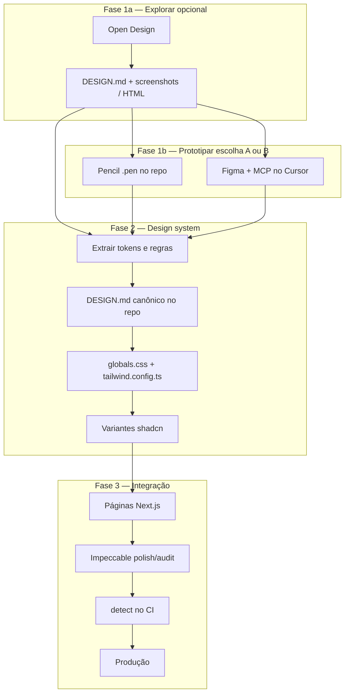

# Pipeline de design — prototipagem → shadcn/ui → Impeccable

> **shadcn/ui = caminho default (Fase 2).** Opt-out e stacks alternativas: [`003-ui-stack-adapters.md`](./003-ui-stack-adapters.md). Procedimento C1-UI: [`002-ui-module-install.md`](./002-ui-module-install.md).
>
> **Importação e estado de adaptação**
>
> - **Origem:** repositório [pvilarim/topocnc-art](https://github.com/pvilarim/topocnc-art), branch `import/site-metal-p5`, importado em 2026-06-27 para **spec-pedro** (`gitnexus-graphify-openspec`).
> - **Status:** `[REFERÊNCIA — REQUER ADAPTAÇÃO]` — pipeline conceitual validado no projeto de origem; caminhos e exemplos de rotas reflectem um monorepo APP com site público e configurador 3D.
> - **Próximo passo:** incorporar este pipeline no guia canónico [`doc/sistema-sdd-pedro.md`](../sistema-sdd-pedro.md) (§ futuro: design system / UI) e propagar via `sdd-kit/` para instalação SDD em **qualquer** repositório alvo (perfis APP, HYBRID ou DOCS_SPECS com app).
> - Secções **[se aplicável]** referem-se a configurador 3D, CNC ou rotas `/app` — omitir em projectos sem esse domínio.

Documento de referência para o fluxo de trabalho de **prototipagem visual** até **integração e manutenção** no código de produção (shadcn/ui + Impeccable).

**Status:** `[PLANEJADO]` — pipeline conceitual; ferramentas ainda não instaladas no repo alvo (exceto Pencil/Figma MCP no ambiente local do desenvolvedor, se configurados).

**Complementa:** [`000-impeccable-design-system-guia.md`](./000-impeccable-design-system-guia.md) (detalhes do Impeccable isolado).

---

## 1. Visão geral

Quatro camadas com responsabilidades distintas:

| Camada | Ferramenta(s) | Papel | Onde vive |
|--------|---------------|-------|-----------|
| **1 · Exploração** | [Open Design](https://github.com/nexu-io/open-design) | POC amplo — várias direções de marca, decks, motion | App/desktop OD (fora do repo) |
| **1b · Prototipagem no repo** | [Pencil](https://www.pencil.dev) **ou** Figma + MCP | Wireframe/alta fidelidade alinhada a shadcn ou marca existente | `.pen` no repo **ou** arquivo Figma (cloud) |
| **2 · Fundação** | **shadcn/ui** + Tailwind | Componentes React e tokens CSS no código real | `components/ui/`, `globals.css` |
| **3 · Qualidade** | [Impeccable](https://github.com/pbakaus/impeccable) | Aperfeiçoamento, consistência e guardrails para agentes | `.cursor/skills/impeccable`, `DESIGN.md` no repo |

> **Caminhos:** em monorepo, prefixar com `apps/web/` (ex.: `apps/web/components/ui/`). Em Next.js na raiz, usar `app/`, `components/ui/` directamente.

### Analogia

```
Open Design     = laboratório (explorar direções)
Pencil          = ateliê no repo (prototipar com shadcn, versionado em Git)
Figma + MCP     = importar marca/UI já desenhada por designer
shadcn/ui       = implementação (componentes + tokens)
Impeccable      = coach + lint de design no código de produção
```

### Pipeline completo (três entradas na Fase 1)



---

## 2. Por que este pipeline

| Problema | Solução no pipeline |
|----------|---------------------|
| Commitar código antes de validar identidade visual | Fase 1 (OD / Pencil / Figma) gera POC sem produção prematura |
| Artefato de POC não roda direto no Next.js | Fase 2 traduz decisões para tokens shadcn |
| Agente “esquece” a marca entre sessões | `DESIGN.md` + Impeccable persistem contexto |
| Visual genérico de IA em produção | Impeccable detecta e bloqueia anti-padrões |
| Design fora do repo envelhece | Pencil (`.pen` no Git) ou Figma como fonte explícita com data de sync |
| Configurador 3D ≠ site marketing **[se aplicável]** | Escopo explícito — pipeline só para **site público** |

---

## 3. Fase 1 — Prototipagem (três ferramentas, dois caminhos principais)

A Fase 1 divide-se em:

- **1a · Open Design** (opcional) — explorar direção de marca em escala
- **1b · Pencil ou Figma** — prototipar a interface que será implementada (escolher **um** como caminho principal de wireframe/alta)

### 3.0 — Qual ferramenta usar? (decisão rápida)

| Situação | Ferramenta recomendada |
|----------|------------------------|
| Redesign amplo; comparar 2–3 identidades visuais | **Open Design** → depois Pencil ou Figma |
| Já sabe a direção; quer wireframe no repo com shadcn | **Pencil** |
| Já existe arquivo Figma de marca/UI; designer usa Figma | **Figma + MCP** |
| Pitch deck, vídeo, motion, 150 `DESIGN.md` prontos | **Open Design** |
| Colaboração designer (fora do IDE) + handoff estruturado | **Figma + MCP** |
| POC versionado em Git, mesmo workspace do Cursor | **Pencil** |
| Só ajuste incremental numa página existente | Pular Fase 1a; **Pencil** ou direto Fase 2 |

### Matriz comparativa

| Critério | Open Design | Pencil | Figma + MCP |
|----------|-------------|--------|-------------|
| Onde vive o design | Fora do repo | `.pen` no repo | Arquivo Figma (cloud) |
| Alinhamento shadcn | Indireto | **Nativo** | Via variáveis / Dev Mode |
| Explorar muitas direções | **⭐⭐⭐** | ⭐⭐ | ⭐ |
| Versionamento Git do design | ❌ | **⭐⭐⭐** | ❌ (só export) |
| Designer não-dev no fluxo | ⭐ | ⭐ | **⭐⭐⭐** |
| Integração Cursor/MCP | ⭐⭐ (`od mcp`) | **⭐⭐⭐** | **⭐⭐⭐** |
| Decks / vídeo / motion | **⭐⭐⭐** | ❌ | ⭐⭐ |
| Curva de setup | Média | Baixa (já instalado) | Média (conta Figma + MCP) |

### Combinações recomendadas

| Combo | Quando usar |
|-------|-------------|
| **OD → Pencil** | Padrão recomendado: OD escolhe marca; Pencil refina landing/galeria no repo com shadcn |
| **Figma → Pencil** | Marca já no Figma; colar/adaptar frames no Pencil; implementar no Cursor |
| **Figma → direto Fase 2** | UI simples; MCP extrai tokens; sem wireframe intermediário |
| **OD → Figma** | OD gera direção; designer formaliza no Figma antes do código |
| **OD + Pencil + Figma** | Só com papéis claros — evitar três fontes de verdade simultâneas |

---

## 3.1 — Fase 1a: Open Design (exploração)

### Objetivo

Validar **direção de marca**, hierarquia, tipografia, cor e tom **antes** de comprometer o repo — especialmente quando ainda não há consenso visual.

### Quando usar

- Redesign de home, galeria ou página de produto **sem** identidade definida
- Comparar 2–3 direções (ex.: industrial minimal vs editorial warm)
- Pitch deck, landing de campanha, motion (HyperFrames)
- Testar um dos 150 `DESIGN.md` prontos (Linear, Stripe, `warm-editorial`, …)

### Quando **não** usar

- Direção visual já aprovada em Figma ou Pencil → ir direto à Fase 1b ou Fase 2
- Configurador `/app`, admin, canvas WebGL **[se aplicável]**

### Setup

```bash
# App desktop: https://open-design.ai
# Ou MCP no Cursor:
od mcp install cursor
```

### Entregáveis → próxima fase

| Entregável | Destino |
|------------|---------|
| `DESIGN.md` aprovado | Base do contrato no repo (Fase 2) |
| Screenshots / HTML | Referência para Pencil ou implementação |
| Anti-referências | Seção do `DESIGN.md` canônico |

Documentação: https://github.com/nexu-io/open-design

---

## 3.2 — Fase 1b (opção A): Pencil

### O que é

[Pencil](https://www.pencil.dev) é um canvas de design **dentro do IDE** (extensão Cursor/VS Code). Arquivos `.pen` (JSON) vivem no repositório, versionados em Git. MCP local expõe o canvas ao agente — alinhado a **shadcn** como design system de referência.

### Objetivo

Prototipar **wireframes ou alta fidelidade** de páginas do site público **no monorepo**, com vocabulário próximo de `components/ui/`, antes de codificar em Next.js.

### Quando usar Pencil

| Cenário | Por quê Pencil |
|---------|----------------|
| POC de home, galeria, produto **no repo** | `.pen` commitável; agente implementa no mesmo workspace |
| Stack já é shadcn + Tailwind | Pencil suporta shadcn como sistema de referência |
| Fluxo solo ou pequena equipe dev | Sem dependência de conta Figma |
| Iteração rápida com agente no Cursor | MCP lê/altera `.pen` e gera React |
| Veio do Open Design com direção aprovada | Traduz `DESIGN.md` em layout concreto antes do código |
| Quer evitar “link Figma desatualizado” | Fonte de design versionada junto ao código |

### Quando **não** usar Pencil

| Cenário | Usar em vez disso |
|---------|-------------------|
| Designer principal trabalha só em Figma | **Figma + MCP** |
| Precisa de deck PPTX ou vídeo MP4 | **Open Design** |
| Explorar 10+ direções de marca rapidamente | **Open Design** primeiro |
| Configurador 3D `/app` **[se aplicável]** | Skills paramétricas do domínio |

### Setup (referência)

1. Extensão **Pencil** no Cursor (Extensions → “Pencil”).
2. Ativar conta / login conforme docs Pencil.
3. Criar arquivo ex.: `design/site-publico.pen` na raiz ou em `app/design/`.
4. Verificar MCP: **Settings → Tools & MCP** → Pencil listado (servidor local ao abrir o `.pen`).
5. Opcional: selecionar design system **shadcn** no Pencil.

Documentação: https://docs.pencil.dev

### Estrutura sugerida no repo

```
design/
  site-home.pen           # POC home
  site-gallery.pen        # POC galeria
  README.md               # [opcional] notas de handoff — só se necessário
```

> **Nota:** pastas `design/` criar na adoção do pipeline no **projeto APP alvo** — não existem neste hub DOCS_SPECS.

### Fluxo na prática

1. Abrir `.pen` no Cursor.
2. Desenhar seções (hero, grid galeria, card produto) com componentes shadcn de referência.
3. Se veio do OD: aplicar paleta/tipo do `DESIGN.md` aprovado.
4. No chat: *“Implemente design/site-home.pen em app/[locale]/page.tsx com @/components/ui/*”*.
5. Passar para Fase 2 (tokens) e Fase 3 (Impeccable).

### Entregáveis → Fase 2

| Entregável | Uso |
|------------|-----|
| `design/*.pen` aprovado | Referência visual para implementação |
| Screenshots exportados | PR / documentação |
| Notas de tokens extraídos | `globals.css`, `DESIGN.md` |

---

## 3.3 — Fase 1b (opção B): Figma + MCP

### O que é

**Figma** como ferramenta de design (cloud); **MCP no Cursor** permite ao agente ler estrutura, screenshots, variáveis e — com skills como `figma-use` — editar nós via Plugin API. Open Design também oferece plugin [`od-figma-migration`](https://github.com/nexu-io/open-design/tree/main/plugins/_official/scenarios/od-figma-migration) para pipeline Figma → tokens → artefato HTML.

### Objetivo

Usar **marca ou UI já existente no Figma** como fonte de verdade visual, importando layout e tokens para o projeto alvo sem redesenhar do zero.

### Quando usar Figma + MCP

| Cenário | Por quê Figma |
|---------|---------------|
| **Já existe** arquivo Figma de marca ou UI | Fonte canônica do designer |
| Designer trabalha fora do IDE | Colaboração padrão da indústria |
| Variáveis/tokens no Figma (cores, tipo, espaçamento) | MCP extrai para `globals.css` |
| Dev Mode / componentes Figma documentados | Handoff estruturado para shadcn |
| Importar frames de referência (moodboard) | Screenshots + metadata via MCP |
| Migração Figma → React via Open Design | Plugin `od-figma-migration` |

### Quando **não** usar Figma + MCP

| Cenário | Usar em vez disso |
|---------|-------------------|
| Não há Figma nem designer Figma | **Pencil** ou **Open Design** |
| Só dev solo; quer tudo no repo | **Pencil** |
| Exploração rápida sem arquivo Figma | **Open Design** |
| POC deve ser commitável em Git sem export manual | **Pencil** |

### Setup (referência)

1. Conta Figma com arquivo do projeto.
2. MCP Figma configurado no Cursor (**Settings → Tools & MCP**).
3. Compartilhar link do arquivo ou node ID com o agente.
4. Para escrita no Figma: carregar skill `figma-use` antes de `use_figma`.

### Fluxo na prática

**Caminho A — Figma → código direto**

1. Agente lê variáveis e layout via MCP (screenshot + metadata).
2. Traduz para `globals.css` + páginas shadcn (Fase 2).
3. Impeccable polish (Fase 3).

**Caminho B — Figma → Pencil → código** (recomendado se quiser `.pen` no repo)

1. Designer mantém Figma como fonte de marca.
2. Colar/adaptar frames relevantes no Pencil.
3. Implementar do `.pen` no Next.js.

**Caminho C — Figma → Open Design → código**

1. Plugin `od-figma-migration` no Open Design (`figma-extract` → `token-map` → artefato).
2. Aprovar HTML/`DESIGN.md`; seguir Fase 2.

### Entregáveis → Fase 2

| Entregável | Uso |
|------------|-----|
| URL do arquivo Figma + node IDs | Referência persistente |
| Variáveis exportadas / documentadas | `globals.css` |
| Screenshots de frames aprovados | Implementação layout |
| Data da última sync Figma → repo | Evitar drift |

### Risco específico

> Figma vive **fora** do repo. Registrar no `DESIGN.md` a **data e versão** do frame aprovado; sem isso, código e design divergem silenciosamente.

---

## 3.4 — Schema `DESIGN.md` (comum às três entradas)

Independente de OD, Pencil ou Figma, o contrato canônico no repo deve cobrir:

1. Color · 2. Typography · 3. Spacing · 4. Layout · 5. Components · 6. Motion · 7. Voice · 8. Brand · 9. Anti-patterns

Open Design usa 9 seções nativas. Ao vir do Pencil ou Figma, redigir ou completar manualmente na Fase 2.

---

## 4. Fase 2 — Transformar POC em design system (shadcn)

### Objetivo

Traduzir decisões visuais da Fase 1 em **tokens e componentes** determinísticos para Next.js.

### Princípio

> Nenhum artefato de prototipagem entra em produção como está (HTML OD, canvas Pencil, frames Figma).  
> O que entra: **tokens CSS**, **variantes shadcn** e **`DESIGN.md` canônico**.

### Fonte do POC → ação na Fase 2

| Fonte Fase 1 | Ação na Fase 2 |
|--------------|----------------|
| Open Design (`DESIGN.md` + screenshots) | Extrair tokens; não copiar HTML |
| Pencil (`.pen`) | Agente implementa com `@/components/ui/*`; extrair tokens do layout aprovado |
| Figma (variáveis + frames) | MCP → HSL em `globals.css`; mapear componentes shadcn |

### Onde gravar no projeto alvo

| Artefato | Caminho sugerido | Função |
|----------|------------------|--------|
| Tokens CSS | `app/globals.css` | `--primary`, `--radius`, … |
| Tema Tailwind | `tailwind.config.ts` | `colors`, `fontFamily`, `borderRadius` |
| Contrato de marca | `DESIGN.md` (raiz do app) | Impeccable + agentes |
| Contexto de produto | `PRODUCT.md` | Público, tom, anti-referências |
| Protótipos Pencil | `design/*.pen` | Referência versionada (não deploy) |
| Componentes | `components/ui/*` | Variantes CVA |

> Em monorepo: prefixar com `apps/web/` nos caminhos acima.

### Checklist de tradução

- [ ] Extrair cores para HSL em `globals.css`
- [ ] Mapear tokens semânticos shadcn (`--primary`, `--muted`, …)
- [ ] Definir `--radius` e fontes
- [ ] Ajustar variantes `button`, `card`, `badge` se necessário
- [ ] Redigir/atualizar `DESIGN.md` canônico no repo
- [ ] Se Figma: anotar versão/frame aprovado no `DESIGN.md`
- [ ] **Não** copiar HTML OD nem export cru Figma para `page.tsx`

### Prompt para agente (Fase 2)

```
Leia doc/design/001-pipeline-open-design-shadcn-impeccable.md.
Fonte do POC: [Open Design | Pencil design/site-home.pen | Figma URL].
Traduza para:
1. app/globals.css (tokens HSL)
2. Ajustes mínimos em components/ui/* se necessário
3. DESIGN.md na raiz alinhado ao shadcn
Reimplementar com @/components/ui/* — sem HTML/PNG como página final.
Escopo: site público apenas; não tocar app/[locale]/app nem lib/parametric [se aplicável].
```

---

## 5. Fase 3 — Integração e aperfeiçoamento com Impeccable

### Objetivo

Manter páginas **alinhadas** ao `DESIGN.md` e **livres de regressões** visuais.

### Setup

```bash
npx impeccable install
# No Cursor:
/impeccable init
/impeccable document
```

Detalhes: [`000-impeccable-design-system-guia.md`](./000-impeccable-design-system-guia.md)

### Comandos por etapa

| Etapa | Comando |
|-------|---------|
| Após implementação | `/impeccable polish landing` |
| Hierarquia | `/impeccable typeset` |
| Cor / contraste | `/impeccable colorize` |
| Espaçamento | `/impeccable layout` |
| Antes do merge | `/impeccable audit` + `npx impeccable detect` |

### Escopo detector (`ignoreFiles`)

```json
{
  "detector": {
    "ignoreFiles": [
      "components/parametric-panel/**",
      "lib/parametric/**",
      "app/**/app/**",
      "app/**/admin/**",
      "app/**/dashboard/**",
      "components/three/**",
      "design/**"
    ]
  }
}
```

> Ajustar prefixo `apps/web/` em monorepo. Entradas `parametric` / `three` são **[se aplicável]**.

> `design/**` ignora arquivos `.pen` no detector — protótipos não são código de produção.

---

## 6. Papéis das ferramentas (resumo)

| Pergunta | Open Design | Pencil | Figma MCP | shadcn | Impeccable |
|----------|-------------|--------|-----------|--------|------------|
| Explorar direções de marca | ✅ | ⚠️ | ⚠️ | ❌ | ❌ |
| POC no repo (Git) | ❌ | ✅ | ❌ | ❌ | ❌ |
| Marca já no Figma | ⚠️ import | colar | ✅ | ❌ | ❌ |
| Alinhado a shadcn | Indireto | ✅ | Via tokens | ✅ | Lê existente |
| Código de produção | ❌ | ❌ | ❌ | ✅ | Orienta |
| Guardrails CI | ❌ | ❌ | ❌ | ❌ | ✅ |

---

## 7. Escopo no projeto alvo

### Dentro do pipeline

| Superfície | Fase 1 | Fase 2 | Fase 3 |
|------------|--------|--------|--------|
| Home | OD / Pencil / Figma | `page.tsx` + tokens | polish / audit |
| Galeria | idem | `gallery/` | polish / audit |
| Produto | idem | `product/[id]/` | polish / audit |
| FAQ, About, Contact | Pencil ou Figma | páginas existentes | clarify / layout |
| Carrinho / checkout | idem | componentes UI | harden / audit |

### Fora do pipeline **[se aplicável]**

| Superfície | Usar |
|------------|------|
| Configurador `/app` | skills paramétricas do domínio |
| Admin / dashboard | shadcn; Impeccable opcional (modo product) |
| Canvas WebGL | Skills paramétricas |

---

## 8. Fluxos de trabalho recomendados

### Fluxo A — Exploração ampla (recomendado para redesign)

1. Brief de produto.
2. **Open Design** — 2–3 direções + `DESIGN.md`.
3. Aprovação humana.
4. **Pencil** — `design/site-*.pen` com shadcn.
5. Fase 2 — tokens + implementação Next.js.
6. Fase 3 — Impeccable + CI.

### Fluxo B — Dev solo, direção já clara (sem OD)

1. Brief.
2. **Pencil** — wireframe/alta no repo.
3. Agente implementa → Fase 2 tokens → Fase 3 Impeccable.

### Fluxo C — Marca no Figma (designer + dev)

1. Designer mantém Figma atualizado.
2. **Figma MCP** — agente extrai variáveis e layout.
3. Opcional: adaptar no **Pencil** para `.pen` versionado.
4. Fase 2 + 3.

### Fluxo D — Incremental (sem redesign)

1. Pular Fase 1a.
2. **Pencil** só na seção alterada (ex.: hero) **ou** patch direto em tokens.
3. `/impeccable polish` na área.

---

## 9. Prompts prontos para agentes

### Escolher ferramenta Fase 1

```
Leia doc/design/001-pipeline-open-design-shadcn-impeccable.md §3.0.
Temos Figma de marca? [sim/não]. Redesign amplo ou ajuste pontual?
Recomende: Open Design, Pencil ou Figma MCP e justifique em 3 linhas.
```

### Pencil → implementação

```
Implemente design/site-home.pen em app/[locale]/page.tsx.
Use apenas @/components/ui/* e tokens de globals.css.
i18n via messages/ — sem strings PT fixas na view.
Depois: /impeccable polish landing.
```

### Figma MCP → tokens

```
Arquivo Figma: [URL]. Extraia variáveis de cor e tipografia para app/globals.css (HSL shadcn).
Atualize DESIGN.md com referência ao frame [nome] e data de sync.
Não copiar export PNG/SVG como layout da página.
```

### Open Design → Pencil

```
Direção aprovada no Open Design [anexar DESIGN.md].
Crie wireframe equivalente em design/site-gallery.pen (shadcn).
Não implementar Next.js ainda.
```

### Pipeline completo

```
Siga doc/design/001-pipeline-open-design-shadcn-impeccable.md.
Fase actual: [1a OD | 1b Pencil | 1b Figma | 2 shadcn | 3 Impeccable].
Escopo: site público apenas.
```

---

## 10. Riscos e mitigações

| Risco | Mitigação |
|-------|-----------|
| Três fontes de verdade (OD + Pencil + Figma) | Escolher **uma** fonte canônica por projeto; OD só para exploração |
| HTML OD / export Figma no `page.tsx` | Reimplementar com shadcn |
| Figma drift | Data + frame ID no `DESIGN.md` |
| `.pen` desatualizado vs código | Commit `.pen` junto com PR de UI |
| Impeccable vs skills paramétricas **[se aplicável]** | `ignoreFiles` para `/app`, `lib/parametric`, `design/**` |
| Pencil MCP offline | Abrir `.pen` antes de chamar o agente |

---

## 11. Licença e custo

| Ferramenta | Licença | Custo |
|------------|---------|-------|
| Open Design | Apache 2.0 | Gratuito; BYOK ou AMR opcional |
| Pencil | Ver [pencil.dev](https://www.pencil.dev) | Extensão; plano conforme vendor |
| Figma | Proprietário | Plano Figma conforme uso |
| Figma MCP (Cursor) | Conforme plugin | Incluso no fluxo Cursor |
| shadcn/ui | MIT | Já no projeto APP |
| Impeccable | Apache 2.0 | Gratuito |

---

## 12. Documentos relacionados

| Documento | Conteúdo |
|-----------|----------|
| [000-impeccable-design-system-guia.md](./000-impeccable-design-system-guia.md) | Impeccable isolado |
| [AGENTS.md](../../AGENTS.md) | Roteamento de agentes |
| [doc/sistema-sdd-pedro.md](../sistema-sdd-pedro.md) | Guia canónico SDD — **destino futuro deste pipeline** |
| [openspec/project.md](../../openspec/project.md) | Constituição do projecto |
| [Open Design](https://github.com/nexu-io/open-design) | Skills, `od-figma-migration` |
| [Pencil docs](https://docs.pencil.dev) | Instalação, MCP |
| [Impeccable](https://github.com/pbakaus/impeccable) | Comandos, detector |

---

## 13. Histórico

| Data | Nota |
|------|------|
| 2026-06-26 | Documento criado no repo de origem — pipeline OD → shadcn → Impeccable |
| 2026-06-26 | Fase 1b: Pencil e Figma MCP — quando usar cada um, fluxos A–D, matriz comparativa |
| 2026-06-27 | Importado para spec-pedro; generalizado para stack SDD; integração no guia SDD pendente |
