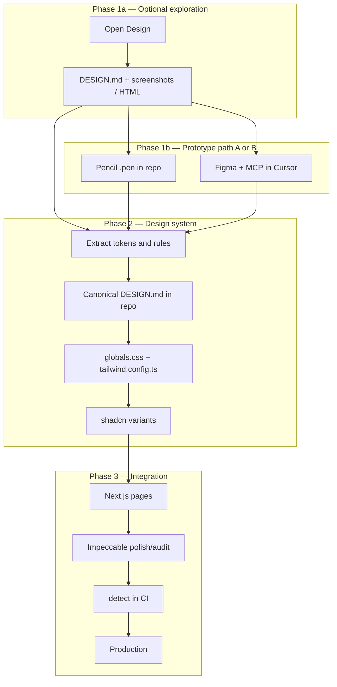

# Design pipeline — prototyping → shadcn/ui → Impeccable

> **shadcn/ui = default path (Phase 2).** Opt-out and alternative stacks: [`003-ui-stack-adapters.md`](./003-ui-stack-adapters.md). C1-UI procedure: [`002-ui-module-install.md`](./002-ui-module-install.md).
>
> **Import and adaptation status**
>
> - **Origin:** [pvilarim/topocnc-art](https://github.com/pvilarim/topocnc-art) repository, branch `import/site-metal-p5`, imported on 2026-06-27 into **spec-pedro** (`gitnexus-graphify-openspec`).
> - **Status:** `[REFERENCE — NEEDS ADAPTATION]` — conceptual pipeline validated in the source project; paths and route examples reflect an APP monorepo with a public site and 3D configurator.
> - **Next step:** incorporate this pipeline into the canonical guide [`doc/byebyevibe-guide.md`](../byebyevibe-guide.md) (future §: design system / UI) and propagate via `sdd-kit/` for SDD installation in **any** target repository (APP, HYBRID, or DOCS_SPECS with an app).
> - Sections marked **[if applicable]** refer to a 3D configurator, CNC, or `/app` routes — omit in projects without that domain.

Reference document for the workflow from **visual prototyping** through **integration and maintenance** in production code (shadcn/ui + Impeccable).

**Status:** `[PLANNED]` — conceptual pipeline; tools not yet installed in the target repo (except Pencil/Figma MCP in the developer's local environment, if configured).

**Complements:** [`000-impeccable-design-system-guia.md`](./000-impeccable-design-system-guia.md) (Impeccable in isolation).

---

## 1. Overview

Four layers with distinct responsibilities:

| Layer | Tool(s) | Role | Where it lives |
|-------|---------|------|----------------|
| **1 · Exploration** | [Open Design](https://github.com/nexu-io/open-design) | Broad POC — multiple brand directions, decks, motion | OD app/desktop (outside the repo) |
| **1b · Prototyping in repo** | [Pencil](https://www.pencil.dev) **or** Figma + MCP | Wireframe/high-fidelity aligned to shadcn or existing brand | `.pen` in repo **or** Figma file (cloud) |
| **2 · Foundation** | **shadcn/ui** + Tailwind | React components and CSS tokens in real code | `components/ui/`, `globals.css` |
| **3 · Quality** | [Impeccable](https://github.com/pbakaus/impeccable) | Polish, consistency, and guardrails for agents | `.cursor/skills/impeccable`, `DESIGN.md` in repo |

> **Paths:** in a monorepo, prefix with `apps/web/` (e.g. `apps/web/components/ui/`). With root-level Next.js, use `app/`, `components/ui/` directly.

### Analogy

```
Open Design     = lab (explore directions)
Pencil          = in-repo studio (prototype with shadcn, Git-versioned)
Figma + MCP     = import brand/UI already designed by a designer
shadcn/ui       = implementation (components + tokens)
Impeccable      = coach + design lint on production code
```

### Full pipeline (three Phase 1 entry points)



---

## 2. Why this pipeline

| Problem | Pipeline solution |
|---------|-------------------|
| Committing code before validating visual identity | Phase 1 (OD / Pencil / Figma) produces POC without premature production |
| POC artifact does not run directly in Next.js | Phase 2 translates decisions into shadcn tokens |
| Agent "forgets" the brand between sessions | `DESIGN.md` + Impeccable persist context |
| Generic AI look in production | Impeccable detects and blocks anti-patterns |
| Design outside the repo goes stale | Pencil (`.pen` in Git) or Figma as explicit source with sync date |
| 3D configurator ≠ marketing site **[if applicable]** | Explicit scope — pipeline only for **public site** |

---

## 3. Phase 1 — Prototyping (three tools, two main paths)

Phase 1 splits into:

- **1a · Open Design** (optional) — explore brand direction at scale
- **1b · Pencil or Figma** — prototype the interface to be implemented (choose **one** as the main wireframe/high-fidelity path)

### 3.0 — Which tool to use? (quick decision)

| Situation | Recommended tool |
|-----------|------------------|
| Broad redesign; compare 2–3 visual identities | **Open Design** → then Pencil or Figma |
| Direction already known; want wireframe in repo with shadcn | **Pencil** |
| Figma brand/UI file already exists; designer uses Figma | **Figma + MCP** |
| Pitch deck, video, motion, 150 ready `DESIGN.md` files | **Open Design** |
| Designer collaboration (outside IDE) + structured handoff | **Figma + MCP** |
| Git-versioned POC, same Cursor workspace | **Pencil** |
| Incremental tweak on an existing page only | Skip Phase 1a; **Pencil** or go straight to Phase 2 |

### Comparison matrix

| Criterion | Open Design | Pencil | Figma + MCP |
|-----------|-------------|--------|-------------|
| Where design lives | Outside repo | `.pen` in repo | Figma file (cloud) |
| shadcn alignment | Indirect | **Native** | Via variables / Dev Mode |
| Explore many directions | **⭐⭐⭐** | ⭐⭐ | ⭐ |
| Git versioning of design | ❌ | **⭐⭐⭐** | ❌ (export only) |
| Non-dev designer in flow | ⭐ | ⭐ | **⭐⭐⭐** |
| Cursor/MCP integration | ⭐⭐ (`od mcp`) | **⭐⭐⭐** | **⭐⭐⭐** |
| Decks / video / motion | **⭐⭐⭐** | ❌ | ⭐⭐ |
| Setup curve | Medium | Low (already installed) | Medium (Figma account + MCP) |

### Recommended combinations

| Combo | When to use |
|-------|-------------|
| **OD → Pencil** | Recommended default: OD picks brand; Pencil refines landing/gallery in repo with shadcn |
| **Figma → Pencil** | Brand already in Figma; paste/adapt frames in Pencil; implement in Cursor |
| **Figma → straight to Phase 2** | Simple UI; MCP extracts tokens; no intermediate wireframe |
| **OD → Figma** | OD generates direction; designer formalizes in Figma before code |
| **OD + Pencil + Figma** | Only with clear roles — avoid three sources of truth at once |

---

## 3.1 — Phase 1a: Open Design (exploration)

### Goal

Validate **brand direction**, hierarchy, typography, color, and tone **before** committing the repo — especially when there is no visual consensus yet.

### When to use

- Home, gallery, or product page redesign **without** a defined identity
- Compare 2–3 directions (e.g. industrial minimal vs editorial warm)
- Pitch deck, campaign landing, motion (HyperFrames)
- Try one of 150 ready `DESIGN.md` files (Linear, Stripe, `warm-editorial`, …)

### When **not** to use

- Visual direction already approved in Figma or Pencil → go straight to Phase 1b or Phase 2
- `/app` configurator, admin, WebGL canvas **[if applicable]**

### Setup

```bash
# Desktop app: https://open-design.ai
# Or MCP in Cursor:
od mcp install cursor
```

### Deliverables → next phase

| Deliverable | Destination |
|-------------|-------------|
| Approved `DESIGN.md` | Contract base in repo (Phase 2) |
| Screenshots / HTML | Reference for Pencil or implementation |
| Anti-references | Section of canonical `DESIGN.md` |

Documentation: https://github.com/nexu-io/open-design

---

## 3.2 — Phase 1b (option A): Pencil

### What it is

[Pencil](https://www.pencil.dev) is a design canvas **inside the IDE** (Cursor/VS Code extension). `.pen` files (JSON) live in the repository, versioned in Git. Local MCP exposes the canvas to the agent — aligned with **shadcn** as the reference design system.

### Goal

Prototype **wireframes or high fidelity** for public-site pages **in the monorepo**, with vocabulary close to `components/ui/`, before coding in Next.js.

### When to use Pencil

| Scenario | Why Pencil |
|----------|------------|
| Home, gallery, product POC **in repo** | Committable `.pen`; agent implements in same workspace |
| Stack is already shadcn + Tailwind | Pencil supports shadcn as reference system |
| Solo or small dev team flow | No Figma account dependency |
| Fast iteration with agent in Cursor | MCP reads/edits `.pen` and generates React |
| Came from Open Design with approved direction | Translates `DESIGN.md` into concrete layout before code |
| Want to avoid "stale Figma link" | Design source versioned alongside code |

### When **not** to use Pencil

| Scenario | Use instead |
|----------|-------------|
| Lead designer works only in Figma | **Figma + MCP** |
| Need PPTX deck or MP4 video | **Open Design** |
| Explore 10+ brand directions quickly | **Open Design** first |
| 3D configurator `/app` **[if applicable]** | Domain parametric skills |

### Setup (reference)

1. **Pencil** extension in Cursor (Extensions → "Pencil").
2. Activate account / login per Pencil docs.
3. Create file e.g. `design/site-publico.pen` at root or in `app/design/`.
4. Verify MCP: **Settings → Tools & MCP** → Pencil listed (local server when `.pen` is open).
5. Optional: select **shadcn** design system in Pencil.

Documentation: https://docs.pencil.dev

### Suggested repo structure

```
design/
  site-home.pen           # home POC
  site-gallery.pen        # gallery POC
  README.md               # [optional] handoff notes — only if needed
```

> **Note:** create `design/` folders when adopting the pipeline in the **target APP project** — they do not exist in this DOCS_SPECS hub.

### Flow in practice

1. Open `.pen` in Cursor.
2. Draw sections (hero, gallery grid, product card) with shadcn reference components.
3. If from OD: apply palette/type from approved `DESIGN.md`.
4. In chat: *"Implement design/site-home.pen in app/[locale]/page.tsx with @/components/ui/*"*.
5. Move to Phase 2 (tokens) and Phase 3 (Impeccable).

### Deliverables → Phase 2

| Deliverable | Use |
|-------------|-----|
| Approved `design/*.pen` | Visual reference for implementation |
| Exported screenshots | PR / documentation |
| Extracted token notes | `globals.css`, `DESIGN.md` |

---

## 3.3 — Phase 1b (option B): Figma + MCP

### What it is

**Figma** as the design tool (cloud); **MCP in Cursor** lets the agent read structure, screenshots, variables, and — with skills like `figma-use` — edit nodes via Plugin API. Open Design also offers plugin [`od-figma-migration`](https://github.com/nexu-io/open-design/tree/main/plugins/_official/scenarios/od-figma-migration) for Figma → tokens → HTML artifact pipeline.

### Goal

Use **brand or UI already in Figma** as the visual source of truth, importing layout and tokens into the target project without redesigning from scratch.

### When to use Figma + MCP

| Scenario | Why Figma |
|----------|-----------|
| **Existing** Figma brand or UI file | Designer's canonical source |
| Designer works outside the IDE | Industry-standard collaboration |
| Variables/tokens in Figma (color, type, spacing) | MCP extracts to `globals.css` |
| Dev Mode / documented Figma components | Structured handoff to shadcn |
| Import reference frames (moodboard) | Screenshots + metadata via MCP |
| Figma → React migration via Open Design | `od-figma-migration` plugin |

### When **not** to use Figma + MCP

| Scenario | Use instead |
|----------|-------------|
| No Figma and no Figma designer | **Pencil** or **Open Design** |
| Solo dev; want everything in repo | **Pencil** |
| Quick exploration without Figma file | **Open Design** |
| POC must be committable in Git without manual export | **Pencil** |

### Setup (reference)

1. Figma account with project file.
2. Figma MCP configured in Cursor (**Settings → Tools & MCP**).
3. Share file link or node ID with the agent.
4. For Figma writes: load `figma-use` skill before `use_figma`.

### Flow in practice

**Path A — Figma → code directly**

1. Agent reads variables and layout via MCP (screenshot + metadata).
2. Translates to `globals.css` + shadcn pages (Phase 2).
3. Impeccable polish (Phase 3).

**Path B — Figma → Pencil → code** (recommended if you want `.pen` in repo)

1. Designer keeps Figma as brand source.
2. Paste/adapt relevant frames in Pencil.
3. Implement from `.pen` in Next.js.

**Path C — Figma → Open Design → code**

1. `od-figma-migration` plugin in Open Design (`figma-extract` → `token-map` → artifact).
2. Approve HTML/`DESIGN.md`; proceed to Phase 2.

### Deliverables → Phase 2

| Deliverable | Use |
|-------------|-----|
| Figma file URL + node IDs | Persistent reference |
| Exported / documented variables | `globals.css` |
| Screenshots of approved frames | Layout implementation |
| Last Figma → repo sync date | Avoid drift |

### Specific risk

> Figma lives **outside** the repo. Record in `DESIGN.md` the **date and version** of the approved frame; without this, code and design diverge silently.

---

## 3.4 — `DESIGN.md` schema (common to all three entry points)

Regardless of OD, Pencil, or Figma, the canonical contract in the repo must cover:

1. Color · 2. Typography · 3. Spacing · 4. Layout · 5. Components · 6. Motion · 7. Voice · 8. Brand · 9. Anti-patterns

Open Design uses 9 native sections. When coming from Pencil or Figma, draft or complete manually in Phase 2.

---

## 4. Phase 2 — Transform POC into design system (shadcn)

### Objective

Translate Phase 1 visual decisions into deterministic **tokens and components** for Next.js.

### Principle

> No prototyping artifact enters production as-is (OD HTML, Pencil canvas, Figma frames).  
> What enters: **CSS tokens**, **shadcn variants**, and **canonical `DESIGN.md`**.

### POC source → Phase 2 action

| Phase 1 source | Phase 2 action |
|----------------|----------------|
| Open Design (`DESIGN.md` + screenshots) | Extract tokens; do not copy HTML |
| Pencil (`.pen`) | Agent implements with `@/components/ui/*`; extract tokens from approved layout |
| Figma (variables + frames) | MCP → HSL in `globals.css`; map shadcn components |

### Where to store in the target project

| Artifact | Suggested path | Function |
|----------|----------------|----------|
| CSS tokens | `app/globals.css` | `--primary`, `--radius`, … |
| Tailwind theme | `tailwind.config.ts` | `colors`, `fontFamily`, `borderRadius` |
| Brand contract | `DESIGN.md` (app root) | Impeccable + agents |
| Product context | `PRODUCT.md` | Audience, tone, anti-references |
| Pencil prototypes | `design/*.pen` | Versioned reference (not deploy) |
| Components | `components/ui/*` | CVA variants |

> In a monorepo: prefix paths above with `apps/web/`.

### Translation checklist

- [ ] Extract colors to HSL in `globals.css`
- [ ] Map shadcn semantic tokens (`--primary`, `--muted`, …)
- [ ] Define `--radius` and fonts
- [ ] Adjust `button`, `card`, `badge` variants if needed
- [ ] Write/update canonical `DESIGN.md` in the repo
- [ ] If Figma: note approved version/frame in `DESIGN.md`
- [ ] **Do not** copy OD HTML or raw Figma export into `page.tsx`

### Agent prompt (Phase 2)

```
Read doc/design/001-pipeline-open-design-shadcn-impeccable.md.
POC source: [Open Design | Pencil design/site-home.pen | Figma URL].
Translate to:
1. app/globals.css (HSL tokens)
2. Minimal adjustments in components/ui/* if needed
3. Root DESIGN.md aligned with shadcn
Reimplement with @/components/ui/* — no HTML/PNG as final page.
Scope: public site only; do not touch app/[locale]/app or lib/parametric [if applicable].
```

---

## 5. Phase 3 — Integration and refinement with Impeccable

### Objective

Keep pages **aligned** with `DESIGN.md` and **free from visual regressions**.

### Setup

```bash
npx impeccable install
# In Cursor:
/impeccable init
/impeccable document
```

Details: [`000-impeccable-design-system-guia.md`](./000-impeccable-design-system-guia.md)

### Commands by stage

| Stage | Command |
|-------|---------|
| After implementation | `/impeccable polish landing` |
| Hierarchy | `/impeccable typeset` |
| Color / contrast | `/impeccable colorize` |
| Spacing | `/impeccable layout` |
| Before merge | `/impeccable audit` + `npx impeccable detect` |

### Detector scope (`ignoreFiles`)

```json
{
  "detector": {
    "ignoreFiles": [
      "components/parametric-panel/**",
      "lib/parametric/**",
      "app/**/app/**",
      "app/**/admin/**",
      "app/**/dashboard/**",
      "components/three/**",
      "design/**"
    ]
  }
}
```

> Adjust `apps/web/` prefix in monorepos. `parametric` / `three` entries are **[if applicable]**.

> `design/**` ignores `.pen` files in the detector — prototypes are not production code.

---

## 6. Tool roles (summary)

| Question | Open Design | Pencil | Figma MCP | shadcn | Impeccable |
|----------|-------------|--------|-----------|--------|------------|
| Explore brand directions | ✅ | ⚠️ | ⚠️ | ❌ | ❌ |
| POC in repo (Git) | ❌ | ✅ | ❌ | ❌ | ❌ |
| Brand already in Figma | ⚠️ import | paste | ✅ | ❌ | ❌ |
| Aligned with shadcn | Indirect | ✅ | Via tokens | ✅ | Reads existing |
| Production code | ❌ | ❌ | ❌ | ✅ | Guides |
| CI guardrails | ❌ | ❌ | ❌ | ❌ | ✅ |

---

## 7. Scope in the target project

### Within the pipeline

| Surface | Phase 1 | Phase 2 | Phase 3 |
|---------|---------|---------|---------|
| Home | OD / Pencil / Figma | `page.tsx` + tokens | polish / audit |
| Gallery | same | `gallery/` | polish / audit |
| Product | same | `product/[id]/` | polish / audit |
| FAQ, About, Contact | Pencil or Figma | existing pages | clarify / layout |
| Cart / checkout | same | UI components | harden / audit |

### Outside the pipeline **[if applicable]**

| Surface | Use |
|---------|-----|
| Configurator `/app` | domain parametric skills |
| Admin / dashboard | shadcn; Impeccable optional (product mode) |
| WebGL canvas | Parametric skills |

---

## 8. Recommended workflows

### Flow A — Broad exploration (recommended for redesign)

1. Product brief.
2. **Open Design** — 2–3 directions + `DESIGN.md`.
3. Human approval.
4. **Pencil** — `design/site-*.pen` with shadcn.
5. Phase 2 — tokens + Next.js implementation.
6. Phase 3 — Impeccable + CI.

### Flow B — Solo dev, direction already clear (no OD)

1. Brief.
2. **Pencil** — wireframe/high-fidelity in repo.
3. Agent implements → Phase 2 tokens → Phase 3 Impeccable.

### Flow C — Brand in Figma (designer + dev)

1. Designer keeps Figma updated.
2. **Figma MCP** — agent extracts variables and layout.
3. Optional: adapt in **Pencil** for versioned `.pen`.
4. Phase 2 + 3.

### Flow D — Incremental (no redesign)

1. Skip Phase 1a.
2. **Pencil** only in the changed section (e.g. hero) **or** direct token patch.
3. `/impeccable polish` on the area.

---

## 9. Ready prompts for agents

### Choose Phase 1 tool

```
Read doc/design/001-pipeline-open-design-shadcn-impeccable.md §3.0.
Do we have brand Figma? [yes/no]. Broad redesign or targeted tweak?
Recommend: Open Design, Pencil, or Figma MCP and justify in 3 lines.
```

### Pencil → implementation

```
Implement design/site-home.pen in app/[locale]/page.tsx.
Use only @/components/ui/* and globals.css tokens.
i18n via messages/ — no hardcoded PT strings in the view.
Then: /impeccable polish landing.
```

### Figma MCP → tokens

```
Figma file: [URL]. Extract color and typography variables to app/globals.css (shadcn HSL).
Update DESIGN.md with reference to frame [name] and sync date.
Do not copy PNG/SVG export as page layout.
```

### Open Design → Pencil

```
Approved direction in Open Design [attach DESIGN.md].
Create equivalent wireframe in design/site-gallery.pen (shadcn).
Do not implement Next.js yet.
```

### Full pipeline

```
Follow doc/design/001-pipeline-open-design-shadcn-impeccable.md.
Current phase: [1a OD | 1b Pencil | 1b Figma | 2 shadcn | 3 Impeccable].
Scope: public site only.
```

---

## 10. Risks and mitigations

| Risk | Mitigation |
|------|------------|
| Three sources of truth (OD + Pencil + Figma) | Choose **one** canonical source per project; OD for exploration only |
| OD HTML / Figma export in `page.tsx` | Reimplement with shadcn |
| Figma drift | Date + frame ID in `DESIGN.md` |
| `.pen` out of date vs code | Commit `.pen` together with UI PR |
| Impeccable vs parametric skills **[if applicable]** | `ignoreFiles` for `/app`, `lib/parametric`, `design/**` |
| Pencil MCP offline | Open `.pen` before calling the agent |

---

## 11. License and cost

| Tool | License | Cost |
|------|---------|------|
| Open Design | Apache 2.0 | Free; optional BYOK or AMR |
| Pencil | See [pencil.dev](https://www.pencil.dev) | Extension; plan per vendor |
| Figma | Proprietary | Figma plan per usage |
| Figma MCP (Cursor) | Per plugin | Included in Cursor workflow |
| shadcn/ui | MIT | Already in APP project |
| Impeccable | Apache 2.0 | Free |

---

## 12. Related documents

| Document | Content |
|----------|---------|
| [000-impeccable-design-system-guia.md](./000-impeccable-design-system-guia.md) | Impeccable in isolation |
| [AGENTS.md](../../AGENTS.md) | Agent routing |
| [doc/byebyevibe-guide.md](../byebyevibe-guide.md) | Canonical SDD guide — **future home of this pipeline** |
| [openspec/project.md](../../openspec/project.md) | Project constitution |
| [Open Design](https://github.com/nexu-io/open-design) | Skills, `od-figma-migration` |
| [Pencil docs](https://docs.pencil.dev) | Installation, MCP |
| [Impeccable](https://github.com/pbakaus/impeccable) | Commands, detector |

---

## 13. History

| Date | Note |
|------|------|
| 2026-06-26 | Document created in source repo — OD → shadcn → Impeccable pipeline |
| 2026-06-26 | Phase 1b: Pencil and Figma MCP — when to use each, flows A–D, comparison matrix |
| 2026-06-27 | Imported to spec-pedro; generalized for SDD stack; SDD guide integration pending |
