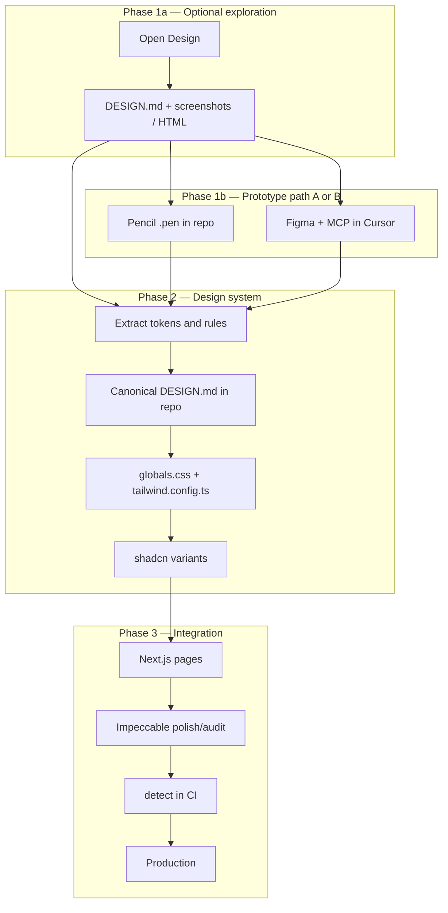

# Design pipeline — prototyping → shadcn/ui → Impeccable

> **shadcn/ui = default path (Phase 2).** Opt-out and alternative stacks: [`003-ui-stack-adapters.md`](./003-ui-stack-adapters.md). C1-UI procedure: [`002-ui-module-install.md`](./002-ui-module-install.md).
>
> **Import and adaptation status**
>
> - **Origin:** [pvilarim/topocnc-art](https://github.com/pvilarim/topocnc-art) repository, branch `import/site-metal-p5`, imported on 2026-06-27 into **spec-pedro** (`gitnexus-graphify-openspec`).
> - **Status:** `[REFERENCE — NEEDS ADAPTATION]` — conceptual pipeline validated in the source project; paths and route examples reflect an APP monorepo with a public site and 3D configurator.
> - **Next step:** incorporate this pipeline into the canonical guide `doc/sistema-sdd-pedro.md` (future §: design system / UI) and propagate via `sdd-kit/` for SDD installation in **any** target repository (APP, HYBRID, or DOCS_SPECS with an app).
> - Sections marked **[if applicable]** refer to a 3D configurator, CNC, or `/app` routes — omit in projects without that domain.

Reference document for the workflow from **visual prototyping** through **integration and maintenance** in production code (shadcn/ui + Impeccable).

**Status:** `[PLANNED]` — conceptual pipeline; tools not yet installed in the target repo (except Pencil/Figma MCP in the developer's local environment, if configured).

**Complements:** [`000-impeccable-design-system-guia.md`](./000-impeccable-design-system-guia.md) (Impeccable in isolation).

---

## 1. Overview

Four layers with distinct responsibilities:

| Layer | Tool(s) | Role | Where it lives |
|-------|---------|------|----------------|
| **1 · Exploration** | [Open Design](https://github.com/nexu-io/open-design) | Broad POC — multiple brand directions, decks, motion | OD app/desktop (outside the repo) |
| **1b · Prototyping in repo** | [Pencil](https://www.pencil.dev) **or** Figma + MCP | Wireframe/high-fidelity aligned to shadcn or existing brand | `.pen` in repo **or** Figma file (cloud) |
| **2 · Foundation** | **shadcn/ui** + Tailwind | React components and CSS tokens in real code | `components/ui/`, `globals.css` |
| **3 · Quality** | [Impeccable](https://github.com/pbakaus/impeccable) | Polish, consistency, and guardrails for agents | `.cursor/skills/impeccable`, `DESIGN.md` in repo |

> **Paths:** in a monorepo, prefix with `apps/web/` (e.g. `apps/web/components/ui/`). With root-level Next.js, use `app/`, `components/ui/` directly.

### Analogy

```
Open Design     = lab (explore directions)
Pencil          = in-repo studio (prototype with shadcn, Git-versioned)
Figma + MCP     = import brand/UI already designed by a designer
shadcn/ui       = implementation (components + tokens)
Impeccable      = coach + design lint on production code
```

### Full pipeline (three Phase 1 entry points)



---

## 2. Why this pipeline

| Problem | Pipeline solution |
|---------|-------------------|
| Committing code before validating visual identity | Phase 1 (OD / Pencil / Figma) produces POC without premature production |
| POC artifact does not run directly in Next.js | Phase 2 translates decisions into shadcn tokens |
| Agent "forgets" the brand between sessions | `DESIGN.md` + Impeccable persist context |
| Generic AI look in production | Impeccable detects and blocks anti-patterns |
| Design outside the repo goes stale | Pencil (`.pen` in Git) or Figma as explicit source with sync date |
| 3D configurator ≠ marketing site **[if applicable]** | Explicit scope — pipeline only for **public site** |

---

## 3. Phase 1 — Prototyping (three tools, two main paths)

Phase 1 splits into:

- **1a · Open Design** (optional) — explore brand direction at scale
- **1b · Pencil or Figma** — prototype the interface to be implemented (choose **one** as the main wireframe/high-fidelity path)

### 3.0 — Which tool to use? (quick decision)

| Situation | Recommended tool |
|-----------|------------------|
| Broad redesign; compare 2–3 visual identities | **Open Design** → then Pencil or Figma |
| Direction already known; want wireframe in repo with shadcn | **Pencil** |
| Figma brand/UI file already exists; designer uses Figma | **Figma + MCP** |
| Pitch deck, video, motion, 150 ready `DESIGN.md` files | **Open Design** |
| Designer collaboration (outside IDE) + structured handoff | **Figma + MCP** |
| Git-versioned POC, same Cursor workspace | **Pencil** |
| Incremental tweak on an existing page only | Skip Phase 1a; **Pencil** or go straight to Phase 2 |

### Comparison matrix

| Criterion | Open Design | Pencil | Figma + MCP |
|-----------|-------------|--------|-------------|
| Where design lives | Outside repo | `.pen` in repo | Figma file (cloud) |
| shadcn alignment | Indirect | **Native** | Via variables / Dev Mode |
| Explore many directions | **⭐⭐⭐** | ⭐⭐ | ⭐ |
| Git versioning of design | ❌ | **⭐⭐⭐** | ❌ (export only) |
| Non-dev designer in flow | ⭐ | ⭐ | **⭐⭐⭐** |
| Cursor/MCP integration | ⭐⭐ (`od mcp`) | **⭐⭐⭐** | **⭐⭐⭐** |
| Decks / video / motion | **⭐⭐⭐** | ❌ | ⭐⭐ |
| Setup curve | Medium | Low (already installed) | Medium (Figma account + MCP) |

### Recommended combinations

| Combo | When to use |
|-------|-------------|
| **OD → Pencil** | Recommended default: OD picks brand; Pencil refines landing/gallery in repo with shadcn |
| **Figma → Pencil** | Brand already in Figma; paste/adapt frames in Pencil; implement in Cursor |
| **Figma → straight to Phase 2** | Simple UI; MCP extracts tokens; no intermediate wireframe |
| **OD → Figma** | OD generates direction; designer formalizes in Figma before code |
| **OD + Pencil + Figma** | Only with clear roles — avoid three sources of truth at once |

---

## 3.1 — Phase 1a: Open Design (exploration)

### Goal

Validate **brand direction**, hierarchy, typography, color, and tone **before** committing the repo — especially when there is no visual consensus yet.

### When to use

- Home, gallery, or product page redesign **without** a defined identity
- Compare 2–3 directions (e.g. industrial minimal vs editorial warm)
- Pitch deck, campaign landing, motion (HyperFrames)
- Try one of 150 ready `DESIGN.md` files (Linear, Stripe, `warm-editorial`, …)

### When **not** to use

- Visual direction already approved in Figma or Pencil → go straight to Phase 1b or Phase 2
- `/app` configurator, admin, WebGL canvas **[if applicable]**

### Setup

```bash
# Desktop app: https://open-design.ai
# Or MCP in Cursor:
od mcp install cursor
```

### Deliverables → next phase

| Deliverable | Destination |
|-------------|-------------|
| Approved `DESIGN.md` | Contract base in repo (Phase 2) |
| Screenshots / HTML | Reference for Pencil or implementation |
| Anti-references | Section of canonical `DESIGN.md` |

Documentation: https://github.com/nexu-io/open-design

---

## 3.2 — Phase 1b (option A): Pencil

### What it is

[Pencil](https://www.pencil.dev) is a design canvas **inside the IDE** (Cursor/VS Code extension). `.pen` files (JSON) live in the repository, versioned in Git. Local MCP exposes the canvas to the agent — aligned with **shadcn** as the reference design system.

### Goal

Prototype **wireframes or high fidelity** for public-site pages **in the monorepo**, with vocabulary close to `components/ui/`, before coding in Next.js.

### When to use Pencil

| Scenario | Why Pencil |
|----------|------------|
| Home, gallery, product POC **in repo** | Committable `.pen`; agent implements in same workspace |
| Stack is already shadcn + Tailwind | Pencil supports shadcn as reference system |
| Solo or small dev team flow | No Figma account dependency |
| Fast iteration with agent in Cursor | MCP reads/edits `.pen` and generates React |
| Came from Open Design with approved direction | Translates `DESIGN.md` into concrete layout before code |
| Want to avoid "stale Figma link" | Design source versioned alongside code |

### When **not** to use Pencil

| Scenario | Use instead |
|----------|-------------|
| Lead designer works only in Figma | **Figma + MCP** |
| Need PPTX deck or MP4 video | **Open Design** |
| Explore 10+ brand directions quickly | **Open Design** first |
| 3D configurator `/app` **[if applicable]** | Domain parametric skills |

### Setup (reference)

1. **Pencil** extension in Cursor (Extensions → "Pencil").
2. Activate account / login per Pencil docs.
3. Create file e.g. `design/site-publico.pen` at root or in `app/design/`.
4. Verify MCP: **Settings → Tools & MCP** → Pencil listed (local server when `.pen` is open).
5. Optional: select **shadcn** design system in Pencil.

Documentation: https://docs.pencil.dev

### Suggested repo structure

```
design/
  site-home.pen           # home POC
  site-gallery.pen        # gallery POC
  README.md               # [optional] handoff notes — only if needed
```

> **Note:** create `design/` folders when adopting the pipeline in the **target APP project** — they do not exist in this DOCS_SPECS hub.

### Flow in practice

1. Open `.pen` in Cursor.
2. Draw sections (hero, gallery grid, product card) with shadcn reference components.
3. If from OD: apply palette/type from approved `DESIGN.md`.
4. In chat: *"Implement design/site-home.pen in app/[locale]/page.tsx with @/components/ui/*"*.
5. Move to Phase 2 (tokens) and Phase 3 (Impeccable).

### Deliverables → Phase 2

| Deliverable | Use |
|-------------|-----|
| Approved `design/*.pen` | Visual reference for implementation |
| Exported screenshots | PR / documentation |
| Extracted token notes | `globals.css`, `DESIGN.md` |

---

## 3.3 — Phase 1b (option B): Figma + MCP

### What it is

**Figma** as the design tool (cloud); **MCP in Cursor** lets the agent read structure, screenshots, variables, and — with skills like `figma-use` — edit nodes via Plugin API. Open Design also offers plugin [`od-figma-migration`](https://github.com/nexu-io/open-design/tree/main/plugins/_official/scenarios/od-figma-migration) for Figma → tokens → HTML artifact pipeline.

### Goal

Use **brand or UI already in Figma** as the visual source of truth, importing layout and tokens into the target project without redesigning from scratch.

### When to use Figma + MCP

| Scenario | Why Figma |
|----------|-----------|
| **Existing** Figma brand or UI file | Designer's canonical source |
| Designer works outside the IDE | Industry-standard collaboration |
| Variables/tokens in Figma (color, type, spacing) | MCP extracts to `globals.css` |
| Dev Mode / documented Figma components | Structured handoff to shadcn |
| Import reference frames (moodboard) | Screenshots + metadata via MCP |
| Figma → React migration via Open Design | `od-figma-migration` plugin |

### When **not** to use Figma + MCP

| Scenario | Use instead |
|----------|-------------|
| No Figma and no Figma designer | **Pencil** or **Open Design** |
| Solo dev; want everything in repo | **Pencil** |
| Quick exploration without Figma file | **Open Design** |
| POC must be committable in Git without manual export | **Pencil** |

### Setup (reference)

1. Figma account with project file.
2. Figma MCP configured in Cursor (**Settings → Tools & MCP**).
3. Share file link or node ID with the agent.
4. For Figma writes: load `figma-use` skill before `use_figma`.

### Flow in practice

**Path A — Figma → code directly**

1. Agent reads variables and layout via MCP (screenshot + metadata).
2. Translates to `globals.css` + shadcn pages (Phase 2).
3. Impeccable polish (Phase 3).

**Path B — Figma → Pencil → code** (recommended if you want `.pen` in repo)

1. Designer keeps Figma as brand source.
2. Paste/adapt relevant frames in Pencil.
3. Implement from `.pen` in Next.js.

**Path C — Figma → Open Design → code**

1. `od-figma-migration` plugin in Open Design (`figma-extract` → `token-map` → artifact).
2. Approve HTML/`DESIGN.md`; proceed to Phase 2.

### Deliverables → Phase 2

| Deliverable | Use |
|-------------|-----|
| Figma file URL + node IDs | Persistent reference |
| Exported / documented variables | `globals.css` |
| Screenshots of approved frames | Layout implementation |
| Last Figma → repo sync date | Avoid drift |

### Specific risk

> Figma lives **outside** the repo. Record in `DESIGN.md` the **date and version** of the approved frame; without this, code and design diverge silently.

---

## 3.4 — `DESIGN.md` schema (common to all three entry points)

Regardless of OD, Pencil, or Figma, the canonical contract in the repo must cover:

1. Color · 2. Typography · 3. Spacing · 4. Layout · 5. Components · 6. Motion · 7. Voice · 8. Brand · 9. Anti-patterns

Open Design uses 9 native sections. When coming from Pencil or Figma, draft or complete manually in Phase 2.

---

## 4. Fase 2 — Transformar POC em design system (shadcn)

### Objetivo

Traduzir decisões visuais da Fase 1 em **tokens e componentes** determinísticos para Next.js.

### Princípio

> Nenhum artefato de prototipagem entra em produção como está (HTML OD, canvas Pencil, frames Figma).  
> O que entra: **tokens CSS**, **variantes shadcn** e **`DESIGN.md` canônico**.

### Fonte do POC → ação na Fase 2

| Fonte Fase 1 | Ação na Fase 2 |
|--------------|----------------|
| Open Design (`DESIGN.md` + screenshots) | Extrair tokens; não copiar HTML |
| Pencil (`.pen`) | Agente implementa com `@/components/ui/*`; extrair tokens do layout aprovado |
| Figma (variáveis + frames) | MCP → HSL em `globals.css`; mapear componentes shadcn |

### Onde gravar no projeto alvo

| Artefato | Caminho sugerido | Função |
|----------|------------------|--------|
| Tokens CSS | `app/globals.css` | `--primary`, `--radius`, … |
| Tema Tailwind | `tailwind.config.ts` | `colors`, `fontFamily`, `borderRadius` |
| Contrato de marca | `DESIGN.md` (raiz do app) | Impeccable + agentes |
| Contexto de produto | `PRODUCT.md` | Público, tom, anti-referências |
| Protótipos Pencil | `design/*.pen` | Referência versionada (não deploy) |
| Componentes | `components/ui/*` | Variantes CVA |

> Em monorepo: prefixar com `apps/web/` nos caminhos acima.

### Checklist de tradução

- [ ] Extrair cores para HSL em `globals.css`
- [ ] Mapear tokens semânticos shadcn (`--primary`, `--muted`, …)
- [ ] Definir `--radius` e fontes
- [ ] Ajustar variantes `button`, `card`, `badge` se necessário
- [ ] Redigir/atualizar `DESIGN.md` canônico no repo
- [ ] Se Figma: anotar versão/frame aprovado no `DESIGN.md`
- [ ] **Não** copiar HTML OD nem export cru Figma para `page.tsx`

### Prompt para agente (Fase 2)

```
Leia doc/design/001-pipeline-open-design-shadcn-impeccable.md.
Fonte do POC: [Open Design | Pencil design/site-home.pen | Figma URL].
Traduza para:
1. app/globals.css (tokens HSL)
2. Ajustes mínimos em components/ui/* se necessário
3. DESIGN.md na raiz alinhado ao shadcn
Reimplementar com @/components/ui/* — sem HTML/PNG como página final.
Escopo: site público apenas; não tocar app/[locale]/app nem lib/parametric [se aplicável].
```

---

## 5. Fase 3 — Integração e aperfeiçoamento com Impeccable

### Objetivo

Manter páginas **alinhadas** ao `DESIGN.md` e **livres de regressões** visuais.

### Setup

```bash
npx impeccable install
# No Cursor:
/impeccable init
/impeccable document
```

Detalhes: [`000-impeccable-design-system-guia.md`](./000-impeccable-design-system-guia.md)

### Comandos por etapa

| Etapa | Comando |
|-------|---------|
| Após implementação | `/impeccable polish landing` |
| Hierarquia | `/impeccable typeset` |
| Cor / contraste | `/impeccable colorize` |
| Espaçamento | `/impeccable layout` |
| Antes do merge | `/impeccable audit` + `npx impeccable detect` |

### Escopo detector (`ignoreFiles`)

```json
{
  "detector": {
    "ignoreFiles": [
      "components/parametric-panel/**",
      "lib/parametric/**",
      "app/**/app/**",
      "app/**/admin/**",
      "app/**/dashboard/**",
      "components/three/**",
      "design/**"
    ]
  }
}
```

> Ajustar prefixo `apps/web/` em monorepo. Entradas `parametric` / `three` são **[se aplicável]**.

> `design/**` ignora arquivos `.pen` no detector — protótipos não são código de produção.

---

## 6. Papéis das ferramentas (resumo)

| Pergunta | Open Design | Pencil | Figma MCP | shadcn | Impeccable |
|----------|-------------|--------|-----------|--------|------------|
| Explorar direções de marca | ✅ | ⚠️ | ⚠️ | ❌ | ❌ |
| POC no repo (Git) | ❌ | ✅ | ❌ | ❌ | ❌ |
| Marca já no Figma | ⚠️ import | colar | ✅ | ❌ | ❌ |
| Alinhado a shadcn | Indireto | ✅ | Via tokens | ✅ | Lê existente |
| Código de produção | ❌ | ❌ | ❌ | ✅ | Orienta |
| Guardrails CI | ❌ | ❌ | ❌ | ❌ | ✅ |

---

## 7. Escopo no projeto alvo

### Dentro do pipeline

| Superfície | Fase 1 | Fase 2 | Fase 3 |
|------------|--------|--------|--------|
| Home | OD / Pencil / Figma | `page.tsx` + tokens | polish / audit |
| Galeria | idem | `gallery/` | polish / audit |
| Produto | idem | `product/[id]/` | polish / audit |
| FAQ, About, Contact | Pencil ou Figma | páginas existentes | clarify / layout |
| Carrinho / checkout | idem | componentes UI | harden / audit |

### Fora do pipeline **[se aplicável]**

| Superfície | Usar |
|------------|------|
| Configurador `/app` | skills paramétricas do domínio |
| Admin / dashboard | shadcn; Impeccable opcional (modo product) |
| Canvas WebGL | Skills paramétricas |

---

## 8. Fluxos de trabalho recomendados

### Fluxo A — Exploração ampla (recomendado para redesign)

1. Brief de produto.
2. **Open Design** — 2–3 direções + `DESIGN.md`.
3. Aprovação humana.
4. **Pencil** — `design/site-*.pen` com shadcn.
5. Fase 2 — tokens + implementação Next.js.
6. Fase 3 — Impeccable + CI.

### Fluxo B — Dev solo, direção já clara (sem OD)

1. Brief.
2. **Pencil** — wireframe/alta no repo.
3. Agente implementa → Fase 2 tokens → Fase 3 Impeccable.

### Fluxo C — Marca no Figma (designer + dev)

1. Designer mantém Figma atualizado.
2. **Figma MCP** — agente extrai variáveis e layout.
3. Opcional: adaptar no **Pencil** para `.pen` versionado.
4. Fase 2 + 3.

### Fluxo D — Incremental (sem redesign)

1. Pular Fase 1a.
2. **Pencil** só na seção alterada (ex.: hero) **ou** patch direto em tokens.
3. `/impeccable polish` na área.

---

## 9. Prompts prontos para agentes

### Escolher ferramenta Fase 1

```
Leia doc/design/001-pipeline-open-design-shadcn-impeccable.md §3.0.
Temos Figma de marca? [sim/não]. Redesign amplo ou ajuste pontual?
Recomende: Open Design, Pencil ou Figma MCP e justifique em 3 linhas.
```

### Pencil → implementação

```
Implemente design/site-home.pen em app/[locale]/page.tsx.
Use apenas @/components/ui/* e tokens de globals.css.
i18n via messages/ — sem strings PT fixas na view.
Depois: /impeccable polish landing.
```

### Figma MCP → tokens

```
Arquivo Figma: [URL]. Extraia variáveis de cor e tipografia para app/globals.css (HSL shadcn).
Atualize DESIGN.md com referência ao frame [nome] e data de sync.
Não copiar export PNG/SVG como layout da página.
```

### Open Design → Pencil

```
Direção aprovada no Open Design [anexar DESIGN.md].
Crie wireframe equivalente em design/site-gallery.pen (shadcn).
Não implementar Next.js ainda.
```

### Pipeline completo

```
Siga doc/design/001-pipeline-open-design-shadcn-impeccable.md.
Fase actual: [1a OD | 1b Pencil | 1b Figma | 2 shadcn | 3 Impeccable].
Escopo: site público apenas.
```

---

## 10. Riscos e mitigações

| Risco | Mitigação |
|-------|-----------|
| Três fontes de verdade (OD + Pencil + Figma) | Escolher **uma** fonte canônica por projeto; OD só para exploração |
| HTML OD / export Figma no `page.tsx` | Reimplementar com shadcn |
| Figma drift | Data + frame ID no `DESIGN.md` |
| `.pen` desatualizado vs código | Commit `.pen` junto com PR de UI |
| Impeccable vs skills paramétricas **[se aplicável]** | `ignoreFiles` para `/app`, `lib/parametric`, `design/**` |
| Pencil MCP offline | Abrir `.pen` antes de chamar o agente |

---

## 11. Licença e custo

| Ferramenta | Licença | Custo |
|------------|---------|-------|
| Open Design | Apache 2.0 | Gratuito; BYOK ou AMR opcional |
| Pencil | Ver [pencil.dev](https://www.pencil.dev) | Extensão; plano conforme vendor |
| Figma | Proprietário | Plano Figma conforme uso |
| Figma MCP (Cursor) | Conforme plugin | Incluso no fluxo Cursor |
| shadcn/ui | MIT | Já no projeto APP |
| Impeccable | Apache 2.0 | Gratuito |

---

## 12. Documentos relacionados

| Documento | Conteúdo |
|-----------|----------|
| [000-impeccable-design-system-guia.md](./000-impeccable-design-system-guia.md) | Impeccable isolado |
| [AGENTS.md](../../AGENTS.md) | Roteamento de agentes |
| [doc/sistema-sdd-pedro.md](../sistema-sdd-pedro.md) | Guia canónico SDD — **destino futuro deste pipeline** |
| [openspec/project.md](../../openspec/project.md) | Constituição do projecto |
| [Open Design](https://github.com/nexu-io/open-design) | Skills, `od-figma-migration` |
| [Pencil docs](https://docs.pencil.dev) | Instalação, MCP |
| [Impeccable](https://github.com/pbakaus/impeccable) | Comandos, detector |

---

## 13. Histórico

| Data | Nota |
|------|------|
| 2026-06-26 | Documento criado no repo de origem — pipeline OD → shadcn → Impeccable |
| 2026-06-26 | Fase 1b: Pencil e Figma MCP — quando usar cada um, fluxos A–D, matriz comparativa |
| 2026-06-27 | Importado para spec-pedro; generalizado para stack SDD; integração no guia SDD pendente |
